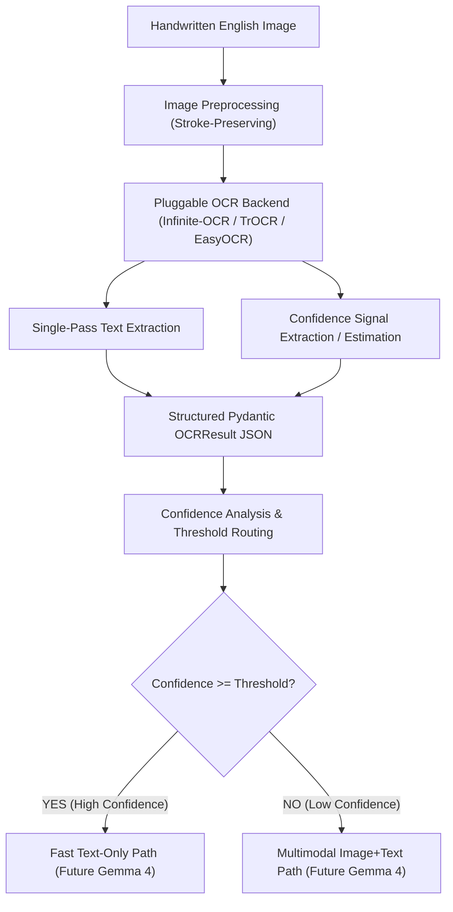

# Stage 1: English Handwritten Examination OCR & Confidence Subsystem Architecture

## 1. System Overview

This subsystem is the **Stage 1 foundational input pipeline** for an automated handwritten English examination grading research system.

Its objective is:
> Given a handwritten English examination-answer script image, perform a single OCR pass to extract the student's text and compute a reliable, measurable OCR confidence score for downstream routing.



---

## 2. Core Architectural Principles

1. **Strictly Single-Pass OCR**:
   - No sequential multi-model OCR cascades (e.g. OCR A $\to$ OCR B).
   - No LLM post-processing or synthetic spelling/grammar rewrite loops.
   - Preserves true raw model outputs.
2. **Separation of Raw vs. Normalized Text**:
   - `raw_text`: Byte-for-byte exact output produced by the OCR engine.
   - `normalized_text`: Safe Unicode NFC and whitespace standardized text (strictly zero word or punctuation rewriting).
3. **Pluggable Backend Abstraction (`OCRBackend`)**:
   - Allows switching between **Infinite-OCR / Nanonets-OCR2-3B / Qwen2.5-VL**, **TrOCR**, and baseline engines without changing downstream contracts.
4. **Distinction Between Confidence and Correctness**:
   - **OCR Confidence**: System self-reported probability or derived text signal $[0.0, 1.0]$.
   - **OCR Correctness**: Empirical quality measured against human-verified ground truth ($\text{CER} \le 5\%$, $\text{WER} \le 15\%$).

---

## 3. Data Contract & Schemas (`src/ocr/schemas.py`)

All OCR executions produce an immutable `OCRResult` JSON record:

```json
{
  "script_id": "EXAM_001",
  "input": {
    "image_path": "data/samples/exam_001.jpg",
    "image_hash": "e3b0c44298fc1c149afbf4c8996fb92427ae41e4649b934ca495991b7852b855",
    "image_size": [1024, 768],
    "page_number": 1
  },
  "ocr": {
    "backend": "infinite_ocr",
    "model": "nanonets/Nanonets-OCR2-3B",
    "raw_text": "Answer to Question Number 11:\nAll people dream...",
    "normalized_text": "Answer to Question Number 11:\nAll people dream...",
    "confidence": 0.9142,
    "confidence_type": "derived",
    "confidence_available": true,
    "segments": []
  },
  "metadata": {
    "processing_time_seconds": 1.45,
    "device": "cuda",
    "gpu_memory_peak_mb": 6144.0,
    "cpu_memory_mb": 450.0,
    "timestamp": "2026-08-22T22:45:00Z"
  }
}
```

---

## 4. Confidence Subsystem (`src/confidence/`)

### 4.1 Aggregation Methods (`aggregation.py`)
For engines outputting token or segment confidences $c_i$ with lengths/weights $w_i$:
- **Mean**: $\frac{1}{N} \sum_{i=1}^N c_i$
- **Minimum**: $\min_{i} (c_i)$
- **Length-Weighted Mean**: $\frac{\sum_{i=1}^N w_i \cdot c_i}{\sum_{i=1}^N w_i}$
- **Geometric Mean**: $\exp\left(\frac{1}{N} \sum_{i=1}^N \ln(\max(\epsilon, c_i))\right)$

### 4.2 Calibration & Reliability (`calibration.py` & `analysis.py`)
- **Platt Scaling (Logistic Calibration)**: $P(Y=1 \mid C) = \frac{1}{1 + \exp(-(a \cdot C + b))}$
- **Isotonic Regression**: Monotonically non-decreasing piecewise constant regression fit strictly on a calibration split.
- **Expected Calibration Error (ECE)**:
  $$\text{ECE} = \sum_{m=1}^M \frac{|B_m|}{N} \left| \text{acc}(B_m) - \text{conf}(B_m) \right|$$
- **Brier Score**:
  $$\text{Brier} = \frac{1}{N} \sum_{i=1}^N (c_i - y_i)^2$$

---

## 5. Evaluation Metrics & 4-Quadrant Routing Analysis

### 5.1 Error Metrics (`src/evaluation/`)
- **Character Error Rate (CER)**: $\text{CER} = \frac{S_c + D_c + I_c}{N_c}$
- **Word Error Rate (WER)**: $\text{WER} = \frac{S_w + D_w + I_w}{N_w}$

### 5.2 Four-Quadrant Routing Decision Matrix
For any evaluated confidence threshold $\tau \in [0.50, 0.95]$:

| | Ground-Truth Correct ($\text{CER} \le 5\%$) | Ground-Truth Incorrect ($\text{CER} > 5\%$) |
|---|---|---|
| **High Confidence** ($C \ge \tau$) | **Q1: True High** (Fast Text-Only Routing) | **Q2: False High (CRITICAL RISK: Erroneous Text Grading)** |
| **Low Confidence** ($C < \tau$) | **Q3: False Low** (Unnecessary Multimodal Compute) | **Q4: True Low (Safe Fallback to Multimodal Inspection)** |

---

## 6. Directory Structure

```text
exam-ocr/
├── README.md
├── ARCHITECTURE.md
├── pyproject.toml
├── configs/
│   ├── ocr.yaml
│   ├── preprocessing.yaml
│   └── confidence.yaml
├── src/
│   ├── ocr/
│   │   ├── __init__.py
│   │   ├── base.py
│   │   ├── infinite_ocr.py
│   │   ├── trocr_backend.py
│   │   ├── easyocr_backend.py
│   │   ├── mock_backend.py
│   │   ├── factory.py
│   │   └── schemas.py
│   ├── preprocessing/
│   │   ├── __init__.py
│   │   └── image.py
│   ├── confidence/
│   │   ├── __init__.py
│   │   ├── aggregation.py
│   │   ├── estimator.py
│   │   ├── calibration.py
│   │   └── analysis.py
│   ├── evaluation/
│   │   ├── __init__.py
│   │   ├── cer.py
│   │   ├── wer.py
│   │   └── threshold.py
│   └── utils/
│       ├── __init__.py
│       ├── hashing.py
│       └── env_info.py
├── scripts/
│   ├── run_ocr.py
│   ├── benchmark_ocr.py
│   ├── analyze_confidence.py
│   ├── calibrate_confidence.py
│   └── threshold_analysis.py
└── tests/
    ├── test_ocr.py
    ├── test_schema.py
    ├── test_confidence.py
    └── test_metrics.py
```
