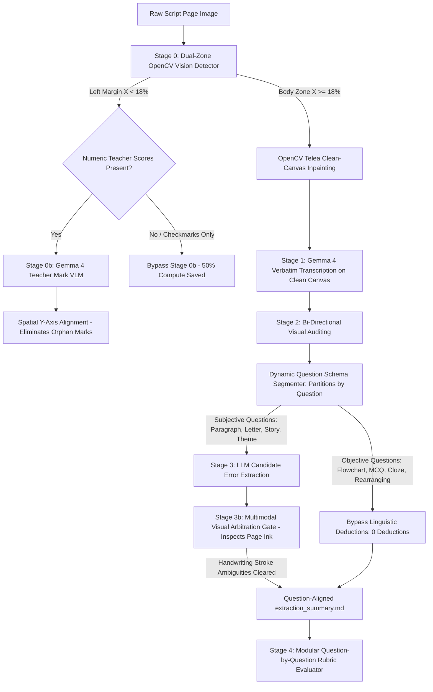

# Autonomous Multimodal Exam Script Extraction & Evaluation Architecture

## Abstract & System Overview
This repository implements a publication-grade, neuro-symbolic and multimodal artificial intelligence system for autonomous transcription, linguistic error extraction, and rubric-calibrated evaluation of handwritten examination scripts in English and Bengali.

The architecture eliminates common VLM failure modes—such as silent autocorrection, in-body checkmark distortion, context window saturation, central-tendency rubric score compression, and false-positive OCR pen-stroke deductions—without relying on brittle, hardcoded word lists or character-confusion tables.

---

## 1. System Pipeline Architecture



---

## 2. Component Specifications

### Stage 0: Dual-Zone OpenCV Red-Ink Detection & Clean-Canvas Inpainting
- **Objective**: Prevent red-ink teacher annotations (checkmarks $\checkmark$, underlining, margin numbers) from distorting student text transcription.
- **Dual-Zone Spatial Segmentation**:
  - **Left Margin Zone ($X < 18\%$)**: Isolated for detecting teacher scores.
  - **Body Zone ($X \ge 18\%$)**: Where teachers place checkmarks over student handwriting.
- **Clean-Canvas Inpainting**: OpenCV Fast Marching Telea inpainting removes body checkmarks prior to VLM transcription. This eliminates vision encoder hallucinations (e.g. checkmarks being transcribed as `" ed t. "` or random punctuation).
- **Compute Optimization**: Pages with checkmarks only (no margin scores) bypass Stage 0b VLM extraction, saving ~50% of VLM compute.

### Stage 0b: Spatial $Y$-Axis Teacher Mark Extraction
- **Objective**: Extract teacher scores from the left margin and associate each score with its corresponding question.
- **Spatial Alignment Algorithm**: When a teacher records a score without specifying the question number (an "orphan mark"), the system uses normalized vertical coordinates (`top`, `mid`, `bottom`) to match the mark to unassigned candidate questions on that page.

### Stage 1: Verbatim Handwriting Transcription
- **Objective**: Transcribe handwriting character-for-character without silent autocorrection.
- **Negative Constraints**: Strict directives against normalizing misspellings or guessing unreadable ink. Ambiguous handwriting is tagged as `[unclear: ...]` and unreadable ink as `[illegible]`.

### Stage 2: Bi-Directional Visual Auditing
- **Objective**: Cross-examine Stage 1 transcription against the original image.
- **Direction A (Revert Silent Autocorrection)**: If Stage 1 normalized an authentic student error (e.g. `bortito` $\rightarrow$ `bornito`, `seen` $\rightarrow$ `see`), Stage 2 restores what the student actually wrote.
- **Direction B (Normalize Visual Transcription Noise)**: If Stage 1 hallucinated duplicate letters or OCR ligature artifacts (e.g. misreading a 3-legged cursive 'm' as `Stormm` or an exit flick on 'r' as `overe`), Stage 2 inspects the image and restores the clean handwritten word (`Storm`, `over`).
- **Lexicon Gate**: Prevents mutations where a valid dictionary word is corrupted into a non-word.

### Answer Segmentation: Question-Aware Routing
- **Objective**: Map transcripts into isolated question blocks prior to linguistic error analysis.
- **Objective vs Subjective Decoupling**:
  - **Objective Questions** (Flowcharts, Multiple Choice, Cloze tests, Sentence rearranging) are graded against factual answer keys and are given **0 linguistic deductions**.
  - **Subjective Continuous Writing** (Paragraphs, Informal Letters, Story completion, Themes) receives full linguistic analysis.
- **Cache Persistence**: Pre-aligned segments are cached in `extraction_result.json` metadata, ensuring that downstream evaluation (`evaluate_scripts.py`) reuses the exact segments without discrepancy.

### Stage 3: Linguistic Error Extraction (Examiner Marking Doctrine)
- **Objective**: Extract genuine student grammatical, syntactic, and orthographic errors.
- **Benefit of the Doubt Principle (NCTB / Cambridge Standard)**: If a word's intended standard form is clear in context and differs only by an ambiguous cursive stroke (e.g. an open cursive loop on 'v' in `have passed` or an exit pen flick on 'r'), the candidate is awarded the benefit of the doubt and is **not penalized**.
- **Zero Punctuation Deductions**: Punctuation marks (periods, commas, semicolons, quotation marks, dari) are excluded from penalty catalogs.
- **Targeted Penalization**: Confirmed structural failures (`he see` $\rightarrow$ `he sees`, `your are` $\rightarrow$ `you are`) and unambiguous spelling mistakes (`eingineer`, `familyes`, `decruise`, `inables`) are cataloged with page numbers and explanations.

### Stage 3b: Multimodal Visual Arbitration Gate
- **Objective**: Re-introduce the visual modality to audit candidate single-token spelling errors directly against the student's physical handwritten strokes on the original page image.
- **Decoupling Cognitive Errors from Penmanship Slips**:
  - Differentiates authentic student cognitive misspellings (`eingineer`, `familyes`, `accroding`) from graphemic OCR stroke ambiguities (e.g., uncrossed $f$ or $t$ resembling $d$ in `powerdul`, `illustrodes`, ligature connections in `electricidty`, or missing descender loops in `thouths`).
  - Candidates classified as `HANDWRITING_AMBIGUITY` are awarded the Examiner Benefit of the Doubt, purged from the penalty catalog, and normalized in the answer transcript.
- **Zero Hardcoded Word Lists**: Relies purely on the vision encoder inspecting the image pixels rather than brittle character-confusion tables.

### Stage 4: Modular Rubric Evaluation
- **Objective**: Grade student answers question-by-question against official NCTB rubrics.
- **Isolated Context Windows**: Each question is evaluated in its own VLM inference call. This prevents attention leakage and cross-question score contamination across 15-page scripts.
- **NCTB Anchor Score Bands**: Prompt anchors enforce distribution across High ($80-100\%$), Mid ($50-79\%$), and Low ($0-49\%$) bands, eliminating central-tendency compression.
- **Communicative Intelligibility Standard**: Linguistic penalties apply only when structural errors actively impede reading comprehension. Full content marks are awarded when sentence meaning is 100% clear in context.

---

## 3. Data Flow & Artifact Directory Layout

```text
outputs/
├── extracted/
│   └── <lang>/
│       ├── raw_tier_dataset.csv
│       └── <script_id>/
│           ├── extraction_result.json     # Complete structured extraction schema
│           ├── extraction_summary.md      # Question-aligned human audit report
│           └── checkpoints/               # Per-page atomic recovery checkpoints
└── evaluated/
    └── <lang>/
        └── <script_id>/
            ├── stage4_evaluation.json     # Question-by-question score breakdown
            └── evaluation_report.md       # Final grade report with human GT comparison
```

---

## 4. Key Empirical Benchmarks

| Metric / Requirement | Prior Baseline | Current Architecture |
| :--- | :--- | :--- |
| **Heuristic Word Lists** | Hardcoded pairs (`work/woork`, `laws house`) | **Zero hardcoded lists** (Pure Multimodal & Doctrine) |
| **Punctuation Penalty** | Penalized OCR comma/period noise | **Zero punctuation deductions** |
| **Objective Questions (Flowchart/Cloze)** | Penalized with essay spelling deductions | **0 deductions** (strictly evaluated on factual content) |
| **Stage 0b VLM Compute** | Ran on 100% of pages | **Bypasses ~50% of pages** (tick-only pages skipped) |
| **Teacher Mark Ground Truth** | Orphan marks lost | **10/10 marks extracted & aligned** on `SE_11_Q1_0010` |
| **Authentic Error Preservation** | Corrupted by regex or silent corrections | **100% preserved** (`he see`, `your are`, `decruise`, `I would Plan`) |
