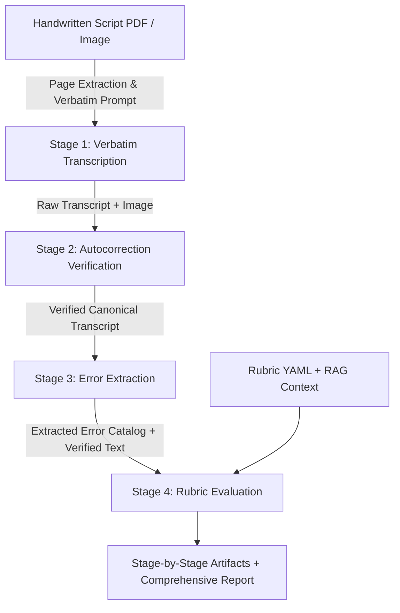

# Complete Guide: 4-Stage Multimodal Exam Script Checking Pipeline

> **Model Target**: Google Gemma 4 31B IT  
> **Target Deployment**: Local CUDA — NVIDIA GeForce RTX 5090 (32GB VRAM) + 32GB System RAM  
> **Development Support**: Zero-weight Mock simulation engine for local PC development  
> **Dataset**: Handwritten Script PDFs with Google Drive auto-download & smart caching  

---

## 📖 Table of Contents
1. [Overview & Core Motivation](#1-overview--core-motivation)
2. [The 4-Stage Pipeline Architecture](#2-the-4-stage-pipeline-architecture)
   - [Stage 1: Verbatim Transcription](#stage-1--verbatim-transcription-image--raw-transcript)
   - [Stage 2: Autocorrection Verification](#stage-2--autocorrection-verification-image--stage-1--verified-transcript)
   - [Stage 3: Error Extraction](#stage-3--error-extraction-text-only)
   - [Stage 4: Rubric Evaluation & Feedback](#stage-4--rubric-evaluation--feedback-verified-text--errors--rubric--rag)
3. [Hardware Profiles & Quantization](#3-hardware-profiles--quantization)
4. [Dataset & Google Drive Smart Caching](#4-dataset--google-drive-smart-caching)
5. [Directory Structure & Stage Artifacts](#5-directory-structure--stage-artifacts)
6. [Step-by-Step Execution Guide](#6-step-by-step-execution-guide)
   - [Phase 1: Local Development on Your PC](#phase-1-local-development-on-your-pc)
   - [Phase 2: Full Deployment on RTX 5090](#phase-2-full-deployment-on-rtx-5090)
7. [CLI Reference & Top Controller](#7-cli-reference--top-controller)
8. [Rubrics & Penalty System](#8-rubrics--penalty-system)
9. [Ablation Studies & Decoding Parameters](#9-ablation-studies--decoding-parameters)
10. [Troubleshooting & FAQ](#10-troubleshooting--faq)

---

## 1. Overview & Core Motivation

Standard Vision-Language Models (VLMs) suffer from an inherent bias known as **"silent autocorrection"**: when reading messy handwriting, language models naturally predict the most statistically probable dictionary word, inadvertently correcting student spelling, grammatical, and syntactic errors.

In educational grading, **preserving student errors is mandatory**, because these errors are the precise target of academic evaluation and rubric deductions.

To resolve this challenge, this repository implements a decoupled **4-Stage Multimodal AI Pipeline** using **Gemma 4 31B IT**:
- Decouples visual recognition from linguistic error checking.
- Introduces an explicit visual verification loop to detect and revert silent model corrections.
- Applies standardized rubric grading with capped language deductions.



---

## 2. The 4-Stage Pipeline Architecture

### Stage 1 — Verbatim Transcription (`Image → Raw Transcript`)
- **Objective**: Exact character-for-character transcription replicating handwritten strokes without editing, grammar fixes, or spelling normalizations.
- **Rules Enforced**:
  1. Transcribe every word exactly as written (including mistakes).
  2. Preserve original word order and sentence structure.
  3. Unclear words are tagged as `[unclear: best reading]`.
  4. Illegible strokes are tagged as `[illegible]` rather than guessing.
  5. Preserve line breaks, punctuation, and paragraph layout.
  6. Do not translate or mix Bangla/English scripts.
  7. Do not summarize, omit, or complete sentences.

### Stage 2 — Autocorrection Verification (`Image + Stage 1 → Verified Transcript`)
- **Objective**: Cross-examine the Stage 1 transcript against the original image to detect silent model corrections.
- **Mechanism**: The model visually compares each line. If Stage 1 output `বর্ণিত` while the handwritten stroke clearly wrote `বর্নিত`, the auditor reverts it to the student's actual error and logs the diff in the audit trail.
- **Output**: Canonical verified transcript + list of reverted silent autocorrection diffs.

### Stage 3 — Error Extraction (`Text Only`)
- **Objective**: Extract all linguistic errors from the verified transcript.
- **Error Categories**:
  - **Spelling**: Misspelled words, Natwa-Satwa Bidhan rules, vowel length mistakes (`ই/ঈ`, `উ/ঊ`).
  - **Grammar**: Subject-verb agreement, tense shifts, preposition errors.
  - **Syntax**: Sentence fragments, word order distortions.
  - **Punctuation**: Missing sentence terminators (দাঁড়ি / periods) and improper punctuation.
- **Output**: JSON catalog and CSV table with exact error words, suggested corrections, context, and rule explanations.

### Stage 4 — Rubric Evaluation & Feedback (`Verified Text + Errors + Rubric + RAG`)
- **Objective**: Calculate transparent marks based on structured criteria and provide constructive feedback.
- **Mechanism**:
  - Content score evaluated criterion by criterion (e.g. জ্ঞান, অনুধাবন, প্রয়োগ, উচ্চতর দক্ষতা).
  - Linguistic penalties deducted per spelling (e.g. -0.25) and grammar error (e.g. -0.5), capped at maximum allowable deduction (e.g. -2.0 max).
  - Integrates textbook RAG context for thematic and factual accuracy.
- **Output**: Awarded marks, justifications, strengths, weaknesses, and actionable improvement steps.

---

## 3. Hardware Profiles & Quantization

| Environment | Hardware Specs | Model Configuration | VRAM Footprint | Description |
| :--- | :--- | :--- | :--- | :--- |
| **Development Mode** | Any PC / Laptop (No GPU required) | `MockGemmaEngine` (`--mock`) | **0 GB** | Fast pipeline prototyping, prompt editing, and test runs. |
| **RTX 5090 Production** | NVIDIA RTX 5090 (32GB VRAM) + 32GB RAM | `Gemma 4 31B IT` (4-bit NF4) | **~18–20 GB** | **Recommended**: Ample headroom for high-res images and 4k context. |
| **RTX 5090 High Precision** | NVIDIA RTX 5090 (32GB VRAM) + 32GB RAM | `Gemma 4 31B IT` (8-bit) | **~30 GB** | Maximum precision fitting directly inside the 32GB VRAM buffer. |

---

## 4. Dataset & Google Drive Smart Caching

Handwritten student exam PDFs are hosted at:
> **Google Drive Folder**: [`https://drive.google.com/drive/folders/11spWhJTncBfM_qsOvpH17AgduhyQpqSN`](https://drive.google.com/drive/folders/11spWhJTncBfM_qsOvpH17AgduhyQpqSN)

### Smart Caching Policy:
- PDFs are downloaded locally into `data/raw_pdfs/`.
- Before downloading, the pipeline checks the local folder. **Already downloaded PDFs are NEVER redownloaded.**
- If you run `--top 5`, the downloader checks if 5 PDFs already exist locally; if yes, it skips downloading entirely.

---

## 5. Directory Structure & Stage Artifacts

```
Ugrad-Thesis-Script-Checking-With-Multimodal-AI/
├── configs/
│   ├── pipeline_config.yaml         # Gemma 4 model settings, quantization & decoding
│   ├── context/                     # RAG reference context files (.txt)
│   └── rubrics/
│       ├── bangla_creative_question.yaml   # Bangla CQ 4-part rubric
│       └── english_writing.yaml            # English essay & comprehension rubric
├── data/
│   ├── raw_pdfs/                    # Downloaded PDF exam scripts
│   └── samples/                     # Rendered 200 DPI PNG images per script page
├── outputs/
│   └── runs/
│       └── <script_id>/             # Stage-by-stage artifacts saved for every script:
│           ├── stage1_transcription.json      # Stage 1 metrics & tags
│           ├── stage1_raw_transcript.txt      # Raw verbatim text
│           ├── stage2_verification.json       # Reverted silent autocorrection diffs
│           ├── stage2_verified_transcript.txt # Verified transcript
│           ├── stage3_errors.json             # Error catalog JSON
│           ├── stage3_errors.csv              # Error list CSV
│           ├── stage4_evaluation.json         # Rubric marks breakdown
│           ├── complete_report.json           # Consolidated 4-stage report
│           └── evaluation_report.md           # Formatted GitHub Markdown report
├── scripts/
│   ├── setup_env.py                 # CUDA, VRAM, and bfloat16 hardware diagnostics
│   ├── process_scripts.py           # Top controller (Google Drive + PDF + Pipeline + Top N)
│   ├── run_pipeline.py              # CLI for single image/PDF evaluation
│   ├── evaluate_benchmark.py        # Thinking mode ablation benchmark
│   └── download_drive_pdfs.py       # Standalone Google Drive downloader with caching
├── src/
│   ├── core/                        # Pydantic schemas and configuration loader
│   ├── engine/                      # Gemma CUDA Engine & Mock Simulation Engine
│   ├── pipeline/                    # 4-stage execution processors & orchestrator
│   ├── prompts/                     # Verbatim, verification, error, and rubric prompts
│   ├── rag/                         # Thematic RAG context provider
│   └── utils/                       # PDF conversion, image loading & export utilities
└── tests/                           # Pytest unit tests for schemas, prompts, and pipeline
```

---

## 6. Step-by-Step Execution Guide

### Phase 1: Local Development on Your PC

1. **Install Dependencies**:
   ```bash
   pip install -r requirements.txt
   ```

2. **Run Environment Check**:
   ```bash
   python scripts/setup_env.py
   ```

3. **Process Top 3 PDFs using Mock Engine**:
   ```bash
   python scripts/process_scripts.py --top 3 --mock
   ```

4. **Run Unit Tests**:
   ```bash
   pytest
   ```

---

### Phase 2: Full Deployment on RTX 5090

1. **Check GPU VRAM & Compute Capability**:
   ```bash
   python scripts/setup_env.py
   ```

2. **Run Pipeline on Top 10 Scripts with Gemma 4 31B IT**:
   ```bash
   python scripts/process_scripts.py --top 10 --model google/gemma-4-31b-it --quant 4bit
   ```

3. **Process All Available PDFs in Batch**:
   ```bash
   python scripts/process_scripts.py --quant 4bit
   ```

4. **Run Thinking Mode Ablation Study**:
   ```bash
   python scripts/evaluate_benchmark.py --image-dir data/samples/ --mock
   ```

---

## 7. CLI Reference & Top Controller

### `scripts/process_scripts.py` Flags:

| Parameter | Default | Description |
| :--- | :--- | :--- |
| `--top N` | `None` (All) | Number of PDFs to download/process (e.g. `--top 5`). |
| `--gdrive-url` | Drive folder | Google Drive folder URL. |
| `--pdf-dir` | `data/raw_pdfs` | Directory where raw PDFs are stored. |
| `--output-dir` | `outputs/runs` | Root directory for stage-by-stage results. |
| `--rubric` | `bangla_creative_question.yaml` | Path to rubric YAML. |
| `--model` | `google/gemma-4-31b-it` | Hugging Face model ID or local checkpoint path. |
| `--quant` | `4bit` | Quantization mode (`4bit`, `8bit`, or `none`). |
| `--mock` | `False` | Run with simulated engine for fast dev without GPU. |
| `--thinking` | `False` | Enable reasoning/thinking mode ablation. |
| `--download-only` | `False` | Only download PDFs from Drive without running evaluation. |
| `--force-download` | `False` | Force re-download even if PDFs exist locally. |

---

## 8. Rubrics & Penalty System

Rubrics are defined in standard YAML under `configs/rubrics/`.

### Example: Bangla Creative Question (`configs/rubrics/bangla_creative_question.yaml`)
```yaml
subject: "Bangla"
question_type: "Creative Question (সৃজনশীল প্রশ্ন - গ/ঘ)"
total_marks: 10.0

criteria:
  - id: "knowledge"
    name: "জ্ঞানমূলক (Knowledge / Recall)"
    max_marks: 2.0
  - id: "comprehension"
    name: "অনুধাবনমূলক (Comprehension)"
    max_marks: 2.0
  - id: "application"
    name: "প্রয়োগমূলক (Application)"
    max_marks: 3.0
  - id: "higher_ability"
    name: "উচ্চতর দক্ষতা (Higher Order Synthesis)"
    max_marks: 3.0

penalties:
  spelling_error_deduction: 0.25      # per distinct major spelling error
  grammar_error_deduction: 0.50       # per grammatical error
  max_linguistic_deduction: 2.00      # maximum deduction cap
```

---

## 9. Ablation Studies & Decoding Parameters

### Decoding Settings:
- **Temperature = 0.0**: Greedy decoding removes sampling randomness to ensure reproducible, strict verbatim transcription.
- **Top_p = 0.1**: Safety threshold if sampling is enabled.
- **Thinking Mode (`--thinking`)**: Allows testing whether model reasoning steps help disambiguate messy strokes or cause additional silent normalizations.

---

## 10. Troubleshooting & FAQ

- **Q: How does the pipeline handle multi-page PDFs?**  
  *A: The pipeline uses `PyMuPDF` to render each page into a 200 DPI image in `data/samples/<script_id>/` and evaluates the content seamlessly.*

- **Q: What if Google Drive rate-limits the download?**  
  *A: You can simply download the PDFs directly and drop them into `data/raw_pdfs/`. The pipeline will automatically find and process them.*

- **Q: Where can I see the stage outputs during processing?**  
  *A: Check `outputs/runs/<script_id>/`. Each stage writes its `.json` and text artifacts as soon as it finishes.*
