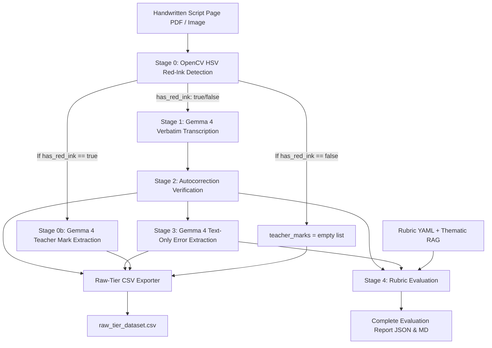

# Complete Guide: Multimodal Exam Script Checking Pipeline (Gemma 4 31B IT)

> **Model Target**: Google Gemma 4 31B IT  
> **Target Deployment**: Local CUDA — NVIDIA GeForce RTX 5090 (32GB VRAM) + 32GB System RAM  
> **Development Support**: Zero-weight Mock simulation engine for local PC development  
> **Dataset**: Handwritten Script PDFs with Google Drive auto-download, smart caching & 13-column Raw-Tier CSV export  

---

## 📖 Table of Contents
1. [Overview & Core Motivation](#1-overview--core-motivation)
2. [Full Extraction & Evaluation Pipeline Architecture](#2-full-extraction--evaluation-pipeline-architecture)
   - [Stage 0: Non-LLM OpenCV Red-Ink Detection](#stage-0--non-llm-opencv-red-ink-detection)
   - [Stage 1: Verbatim Transcription](#stage-1--verbatim-transcription-gemma-4-multimodal)
   - [Stage 2: Autocorrection Verification & Audit](#stage-2--autocorrection-verification--audit-gemma-4-multimodal)
   - [Stage 3: Linguistic Error Extraction](#stage-3--linguistic-error-extraction-gemma-4-text-only)
   - [Stage 0b: Red-Ink Teacher Mark Extraction](#stage-0b--red-ink-teacher-mark-extraction-conditional-gemma-4)
   - [Stage 4: Rubric Evaluation & Pedagogical Feedback](#stage-4--rubric-evaluation--pedagogical-feedback)
3. [Decoupled Modular Workflow (Extraction vs Evaluation)](#3-decoupled-modular-workflow-extraction-vs-evaluation)
   - [Dedicated Extraction Tool (`scripts/extract_scripts.py`)](#dedicated-extraction-tool-scriptsextract_scriptspy)
   - [Dedicated Evaluation Tool (`scripts/evaluate_scripts.py`)](#dedicated-evaluation-tool-scriptsevaluate_scriptspy)
   - [Unified End-to-End Controller (`scripts/process_scripts.py`)](#unified-end-to-end-controller-scriptsprocess_scriptspy)
4. [Raw-Tier Research Dataset Specification (CSV Export)](#4-raw-tier-research-dataset-specification-csv-export)
5. [Hardware Profiles & Quantization](#5-hardware-profiles--quantization)
6. [Dataset & Google Drive Smart Caching](#6-dataset--google-drive-smart-caching)
7. [Directory Structure & Stage Artifacts](#7-directory-structure--stage-artifacts)
8. [Step-by-Step Execution Guide](#8-step-by-step-execution-guide)
   - [Phase 1: Local Development on Your PC](#phase-1-local-development-on-your-pc)
   - [Phase 2: Full Deployment on RTX 5090](#phase-2-full-deployment-on-rtx-5090)
9. [Rubrics & Penalty System](#9-rubrics--penalty-system)
10. [Troubleshooting & FAQ](#10-troubleshooting--faq)

---

## 1. Overview & Core Motivation

Standard Vision-Language Models (VLMs) suffer from an inherent bias known as **"silent autocorrection"**: when reading messy handwriting, language models naturally predict the most statistically probable dictionary word, inadvertently correcting student spelling, grammatical, and syntactic errors.

In educational grading, **preserving student errors is mandatory**, because these errors are the precise target of academic evaluation and rubric deductions.

Furthermore, teacher evaluations and research datasets require isolating **teacher-annotated red-ink scores** from student handwriting, ensuring no grading bias when evaluating content or running MFRM (Many-Facet Rasch Measurement) scoring.

To resolve these challenges, this repository implements a decoupled **Multi-Stage AI Pipeline** using **Gemma 4 31B IT**:
- **Pure Computer Vision Stage 0**: Detects red-ink annotations without consuming LLM compute.
- **Strict Verbatim Stage 1**: Transcribes student handwriting, ignoring teacher marks and preserving errors character-for-character.
- **Visual Auditor Stage 2**: Explicit visual cross-verification to detect and revert silent model normalizations.
- **Text-Only Linguistic Stage 3**: Catalogs spelling, grammar, syntax, and punctuation errors.
- **Conditional Stage 0b**: Extracts teacher marks *only* when red ink is physically present.
- **Standardized Raw-Tier Dataset**: Exports structured 13-column CSV records for research and scoring tiers.
- **Stage 4 Rubric Evaluation**: Grades verified text against criteria with capped linguistic penalties.

---

## 2. Full Extraction & Evaluation Pipeline Architecture



### Stage 0 — Non-LLM OpenCV Red-Ink Detection
- **Tool**: OpenCV, HSV color-space thresholding (no LLM). Runs on every page.
- **Algorithm**: Dual-range red hue masks ($H \in [0, 10] \cup [170, 180], S \ge 60, V \ge 60$) with morphological filtering to eliminate dust/compression noise.
- **Output**: `has_red_ink: true/false`, `red_pixel_count`, `red_pixel_ratio`.

### Stage 1 — Verbatim Transcription (`Gemma 4 Multimodal`)
- **Tool**: Gemma 4 31B IT, greedy decoding (`temperature=0.0`, `top_p=0.1`).
- **Prompt Rules**:
  1. Transcribe ONLY the student's original answer (black/blue ink). Ignore teacher red-ink comments, ticks, and scores.
  2. Transcribe every word exactly as written, including spelling mistakes, grammar errors, and incorrect word choices. Do NOT fix them.
  3. Preserve original word order and sentence structure.
  4. If a word or phrase is struck through, transcribe it as `[struck: original text]`.
  5. If text is illegible, write `[illegible]` rather than guessing.
  6. If ambiguous, write `[unclear: your reading]`.
  7. Preserve line breaks and paragraph layout. Do not translate.

### Stage 2 — Autocorrection Verification & Audit (`Gemma 4 Multimodal`)
- **Tool**: Gemma 4 31B IT.
- **Mechanism**: The model visually compares the Stage 1 transcript against the handwriting image. If Stage 1 output `বর্ণিত` while the handwritten stroke wrote `বর্নিত`, the auditor reverts it to the student's actual error and logs the diff in `stage2_verification.json`.
- **Output**: Canonical verified transcript + list of reverted silent autocorrection diffs.

### Stage 3 — Linguistic Error Extraction (`Gemma 4 Text-Only`)
- **Tool**: Gemma 4 31B IT (text-only prompt on verified text).
- **Error Categories**:
  - **Spelling**: Misspellings, Natwa-Satwa Bidhan rules, vowel length mistakes (`ই/ঈ`, `উ/ঊ`).
  - **Grammar**: Subject-verb agreement, tense shifts, preposition errors.
  - **Syntax**: Sentence fragments, word order distortions.
  - **Punctuation**: Missing sentence terminators (দাঁড়ি / periods).
- **Output**: `stage3_errors.json` and `stage3_errors.csv` with exact erroneous words, suggested corrections, context sentences, and linguistic explanations.

### Stage 0b — Red-Ink Teacher Mark Extraction (`Conditional Gemma 4`)
- **Tool**: Gemma 4 31B IT.
- **Trigger**: Runs **ONLY** on pages flagged `has_red_ink: true` in Stage 0. (Bypassed if false, saving compute).
- **Schema**:
  ```json
  [
    {
      "question_no": "1",
      "mark_value": "7/10",
      "location": "margin next to answer 1"
    }
  ]
  ```
- **Post-Processing**: Validated via strict JSON validator `extract_marks()`. Malformed outputs are flagged for manual review rather than dropped.

### Stage 4 — Rubric Evaluation & Pedagogical Feedback
- **Tool**: Gemma 4 31B IT (evaluated on verified text and error list).
- **Isolation Constraint**: Teacher marks and marker IDs are kept strictly isolated from grading inputs to eliminate bias.
- **Mechanism**: Calculates criteria scores (জ্ঞান, অনুধাবন, প্রয়োগ, উচ্চতর দক্ষতা), subtracts capped language deductions, and generates teacher-level feedback and recommendations.

---

## 3. Decoupled Modular Workflow (Extraction vs Evaluation)

The workflow is decoupled into two independent tools:

### Dedicated Extraction Tool (`scripts/extract_scripts.py`)
Runs Stages 0, 1, 2, 3, and 0b, saving all verified transcripts, error catalogs, and raw-tier CSV records to disk.

```powershell
# Interactive Setup:
python scripts/extract_scripts.py

# Extract Top 5 Bangla scripts on GPU:
python scripts/extract_scripts.py --lang bangla --top 5 --quant 4bit

# Fast Mock mode on development PC:
python scripts/extract_scripts.py --lang bangla --top 3 --mock
```

### Dedicated Evaluation Tool (`scripts/evaluate_scripts.py`)
Runs Stage 4 grading without re-running vision extraction. Accepts **either** a specific script name **or** a count (`--top N`).

```powershell
# Option A: Evaluate by specific script name:
python scripts/evaluate_scripts.py --script-name sample_bangla_01 --lang bangla

# Option B: Evaluate Top 5 scripts from the extraction directory:
python scripts/evaluate_scripts.py --top 5 --lang bangla

# Option C: Re-grade with a custom rubric without re-extracting:
python scripts/evaluate_scripts.py --rubric configs/rubrics/bangla_creative_question.yaml --force-evaluate
```

### Unified End-to-End Controller (`scripts/process_scripts.py`)
Runs all stages end-to-end for a complete batch run:

```powershell
python scripts/process_scripts.py --lang bangla --top 10 --quant 4bit
```

---

## 4. Raw-Tier Research Dataset Specification (CSV Export)

Every extraction run appends records to `outputs/extracted/<lang>/raw_tier_dataset.csv` with the exact 13 required columns:

| Column | Description |
| :--- | :--- |
| `script_id` | Unique exam script identifier (e.g. `sample_bangla_01`). |
| `page_no` | 1-indexed page number within the script. |
| `question_no` | Question number (if identified from teacher mark or prompt). |
| `paper` | Subject / Language (`bangla` or `english`). |
| `task_type` | Task type (`creative_question`, `essay`, `summary`, etc.). |
| `transcript_text` | Verified canonical transcript from Stages 1 & 2. |
| `ocr_flags` | Counts of `[illegible]`, `[unclear]`, and `[struck]` tags. |
| `error_list` | JSON list of Stage 3 spelling, grammar, and syntax errors. |
| `teacher_mark` | Extracted red-ink teacher marks (Stage 0b). |
| `has_red_ink` | Boolean from Stage 0 (`True` / `False`). |
| `original_marker_id` | Teacher/examiner ID for severity calibration. |
| `school_id` | Subgroup / school stratification identifier. |
| `region` | Regional stratification identifier. |

---

## 5. Hardware Profiles & Quantization

| Environment | Hardware Specs | Configuration | VRAM Footprint | Description |
| :--- | :--- | :--- | :--- | :--- |
| **Development PC** | Any PC / Laptop (No GPU required) | `--mock` | **0 GB** | Fast simulation mode for pipeline logic and UI testing. |
| **RTX 5090 Production** | NVIDIA RTX 5090 (32GB VRAM) + 32GB RAM | `Gemma 4 31B IT` (`--quant 4bit`) | **~18–20 GB** | **Recommended**: Fast inference with ample headroom for 4k context. |
| **RTX 5090 High Precision** | NVIDIA RTX 5090 (32GB VRAM) + 32GB RAM | `Gemma 4 31B IT` (`--quant 8bit`) | **~30 GB** | Maximum precision fitting inside the 32GB VRAM buffer. |

---

## 6. Dataset & Google Drive Smart Caching

Handwritten student exam PDFs are hosted at:
> **Google Drive Dataset**: [`https://drive.google.com/drive/folders/11spWhJTncBfM_qsOvpH17AgduhyQpqSN`](https://drive.google.com/drive/folders/11spWhJTncBfM_qsOvpH17AgduhyQpqSN)

### Smart Caching:
- PDFs are downloaded into `data/raw_pdfs/<lang>/`.
- Before downloading, local PDFs are scanned. **Already downloaded PDFs are NEVER redownloaded.**
- `--top N` checks if $N$ PDFs already exist locally before triggering network requests.

---

## 7. Directory Structure & Stage Artifacts

```
Ugrad-Thesis-Script-Checking-With-Multimodal-AI/
├── configs/
│   ├── pipeline_config.yaml         # Model settings, quantization & decoding
│   ├── context/                     # RAG reference context files (.txt)
│   └── rubrics/
│       ├── bangla_creative_question.yaml   # Bangla CQ rubric
│       └── english_writing.yaml            # English writing rubric
├── data/
│   ├── raw_pdfs/                    # Downloaded PDF exam scripts (bangla / english)
│   └── samples/                     # Rendered 200 DPI PNG images per script page
├── outputs/
│   └── extracted/
│       └── <lang>/
│           ├── raw_tier_dataset.csv         # Consolidated 13-column research CSV
│           └── <script_id>/                 # Per-script artifacts:
│               ├── stage0b_teacher_marks.json   # Stage 0b extracted teacher marks
│               ├── stage1_transcription.json    # Stage 1 metrics & character stats
│               ├── stage1_raw_transcript.txt    # Raw verbatim text
│               ├── stage2_verification.json     # Reverted silent autocorrection diffs
│               ├── stage2_verified_transcript.txt # Verified canonical transcript
│               ├── stage3_errors.json           # Extracted linguistic error catalog
│               ├── stage3_errors.csv            # Error list table (spelling/grammar)
│               ├── extraction_result.json       # Consolidated extraction package
│               ├── extraction_summary.md        # Human-readable extraction summary
│               ├── raw_tier_records.csv         # Per-script raw-tier CSV records
│               ├── stage4_evaluation.json       # Rubric marks breakdown & deductions
│               ├── complete_report.json         # Consolidated 4-stage evaluation report
│               └── evaluation_report.md         # Teacher evaluation report
├── scripts/
│   ├── extract_scripts.py           # Dedicated Extraction Runner (Stages 0, 1, 2, 3, 0b)
│   ├── evaluate_scripts.py          # Dedicated Evaluation Runner (Stage 4 Rubric)
│   ├── process_scripts.py           # Top-level unified controller
│   ├── setup_env.py                 # GPU & CUDA diagnostic verifier
│   └── download_drive_pdfs.py       # Google Drive sync utility
├── src/
│   ├── core/                        # Pydantic schemas (schemas.py) and config (config.py)
│   ├── engine/                      # Gemma CUDA Engine & Mock Simulation Engine
│   ├── pipeline/                    # Stage 0, 0b, 1, 2, 3, 4 processors & orchestrator
│   ├── prompts/                     # Verbatim, marks, verification, error, and rubric prompts
│   ├── rag/                         # Thematic RAG context provider
│   └── utils/                       # OpenCV image loader, PDF converter & export utilities
└── tests/                           # Unit tests covering all pipeline stages
```

---

## 8. Step-by-Step Execution Guide

### Phase 1: Local Development on Your PC

1. **Activate Virtual Environment**:
   ```powershell
   D:\environments\myenv\scripts\Activate.ps1
   ```

2. **Install Dependencies**:
   ```powershell
   pip install -r requirements.txt
   ```

3. **Run Unit Tests**:
   ```powershell
   python -c "import tests.test_pipeline_mock as t; t.test_stage0_red_ink_detector(); t.test_stage0b_teacher_mark_extractor(); t.test_full_pipeline_mock_image(); t.test_separate_extraction_and_evaluation(); print('All tests passed!')"
   ```

4. **Run Extraction (Stages 0 to 3)**:
   ```powershell
   python scripts/extract_scripts.py --top 2 --mock --lang bangla
   ```

5. **Run Evaluation by Script Name (Stage 4)**:
   ```powershell
   python scripts/evaluate_scripts.py --script-name sample_bangla_01 --mock --lang bangla
   ```

---

### Phase 2: Full Deployment on RTX 5090

1. **Check GPU Environment & VRAM**:
   ```bash
   python scripts/setup_env.py
   ```

2. **Run GPU Extraction on Bangla Scripts (Gemma 4 31B IT, 4-bit NF4)**:
   ```bash
   python scripts/extract_scripts.py --lang bangla --top 10 --quant 4bit
   ```

3. **Run Rubric Evaluation on Extracted Scripts**:
   ```bash
   python scripts/evaluate_scripts.py --lang bangla --top 10 --quant 4bit
   ```

4. **Inspect Generated Raw-Tier Research CSV**:
   ```bash
   cat outputs/extracted/bangla/raw_tier_dataset.csv
   ```

---

## 9. Rubrics & Penalty System

Rubrics are defined in standard YAML under `configs/rubrics/`.

### Example: Bangla Creative Question (`configs/rubrics/bangla_creative_question.yaml`)
```yaml
subject: "Bangla"
question_type: "Creative Question (সৃজনশীল প্রশ্ন - গ/ঘ)"
total_marks: 10.0

criteria:
  - id: "knowledge"
    name: "জ্ঞানমূলক (Knowledge / Recall)"
    max_marks: 2.0
  - id: "comprehension"
    name: "অনুধাবনমূলক (Comprehension)"
    max_marks: 2.0
  - id: "application"
    name: "প্রয়োগমূলক (Application)"
    max_marks: 3.0
  - id: "higher_ability"
    name: "উচ্চতর দক্ষতা (Higher Order Synthesis)"
    max_marks: 3.0

penalties:
  spelling_error_deduction: 0.25      # per distinct major spelling error
  grammar_error_deduction: 0.50       # per grammatical error
  max_linguistic_deduction: 2.00      # maximum deduction cap
```

---

## 10. Troubleshooting & FAQ

- **Q: Why does Stage 0 run on OpenCV instead of Gemma 4?**  
  *A: OpenCV HSV color thresholding runs in ~5ms without consuming GPU VRAM or LLM tokens, filtering out pages without teacher marks instantly.*

- **Q: How are teacher marks isolated from grading?**  
  *A: Stage 0b extracts teacher marks into the raw-tier dataset, but Stage 4 evaluation receives ONLY the verified transcript and Stage 3 error catalog, ensuring completely unbiased scoring.*

- **Q: How do I re-grade scripts with a different rubric without re-extracting?**  
  *A: Run `python scripts/evaluate_scripts.py --rubric path/to/new_rubric.yaml --force-evaluate`. It immediately re-grades using the pre-extracted transcripts.*
