# Modular Answer-Script OCR & Multimodal AI Grading Pipeline

An end-to-end, modular vision-language pipeline for transcribing, segmenting, and automatically grading scanned handwritten examination scripts (NCTB HSC/SSC English & Bangla) with rubric alignment, multi-pass OCR supervision, 4-criterion analytic evaluation, and deterministic mathematical auditing.

[](https://drive.google.com/drive/folders/1ijH5q24-dHC2LimjYsWpTLMpRXp8G63z?dmr=1&ec=wgc-drive-%5Bmodule%5D-goto)

> **📥 Dataset Download:** All scanned student script PDFs, ground-truth labels, and assets can be accessed and downloaded from Google Drive:  
> 🔗 **[https://drive.google.com/drive/folders/1ijH5q24-dHC2LimjYsWpTLMpRXp8G63z](https://drive.google.com/drive/folders/1ijH5q24-dHC2LimjYsWpTLMpRXp8G63z?dmr=1&ec=wgc-drive-%5Bmodule%5D-goto)**

---

## 🏛️ Pipeline State Machine Architecture

The pipeline processes exam scripts through a formal, deterministic finite-state sequence across **6 decoupled stages**, ensuring modularity, visual stroke verification, and mathematical compliance.

```mermaid
stateDiagram-v2
    [*] --> Ingestion

    state Ingestion {
        [*] --> LoadScannedPDF
        LoadScannedPDF --> RasterizeImages: 300 DPI Rendering
        RasterizeImages --> NormalizeDimensions: Clamp max side (2048px)
        NormalizeDimensions --> PageRouting: Map via extraction.csv / Header Vision
        PageRouting --> [*]: Output Segmented Task Pages
    }

    Ingestion --> Stage1_ColdOCR: Normalized Question Page Images

    state Stage1_ColdOCR {
        [*] --> UnbiasedExtraction
        UnbiasedExtraction --> StrokeScrutiny: Identify [struck: ...] scratch-outs
        StrokeScrutiny --> UncertaintyFlagging: Mark ambiguous smudges / tears
        UncertaintyFlagging --> [*]: Yield Candidate A Transcription
    }

    Stage1_ColdOCR --> Stage2_RubricAligner: Candidate A Text

    state Stage2_RubricAligner {
        [*] --> CompareWithOfficialPrompt
        state RubricDecision <<choice>>
        CompareWithOfficialPrompt --> RubricDecision
        RubricDecision --> KEEP: Canonical topic answered
        RubricDecision --> REPAIR: Notation / terminology slip
        RubricDecision --> ADAPT: Valid alternative derivation
        ADAPT --> GenerateShadowSolution: Build custom reference & rubric
        KEEP --> FinalizeOperativeRubric
        REPAIR --> FinalizeOperativeRubric
        GenerateShadowSolution --> FinalizeOperativeRubric
        FinalizeOperativeRubric --> [*]: Output Operative Rubric & Notes
    }

    Stage2_RubricAligner --> Stage3_ReferencePrimedOCR: Operative Rubric & Reference Solution

    state Stage3_ReferencePrimedOCR {
        [*] --> LexicallyPrimedOCR
        LexicallyPrimedOCR --> ResolveAmbiguities: Benefit of doubt on illegible strokes
        ResolveAmbiguities --> RestrictOverrides: Prevent changing clear text
        RestrictOverrides --> [*]: Yield Candidate B Transcription
    }

    Stage1_ColdOCR --> Stage4_OCRSupervisor: Candidate A
    Stage3_ReferencePrimedOCR --> Stage4_OCRSupervisor: Candidate B
    Ingestion --> Stage4_OCRSupervisor: Raw Scanned Images

    state Stage4_OCRSupervisor {
        [*] --> CompareCandidates
        CompareCandidates --> StrokeAdjudication: Visual stroke alignment check
        StrokeAdjudication --> EliminateHallucinations: Select highest visual fidelity
        EliminateHallucinations --> [*]: Yield Authoritative Ground Truth OCR
    }

    Stage4_OCRSupervisor --> Stage5_ChiefExaminer: Authoritative OCR Text
    Stage2_RubricAligner --> Stage5_ChiefExaminer: Operative Rubric

    state Stage5_ChiefExaminer {
        [*] --> AnalyticCriterionGrading
        AnalyticCriterionGrading --> ScoreCriterion1: Context / Content / Data
        AnalyticCriterionGrading --> ScoreCriterion2: Structure / Format / Brevity
        AnalyticCriterionGrading --> ScoreCriterion3: Language Mechanics
        AnalyticCriterionGrading --> ScoreCriterion4: Originality / Synthesis
        ScoreCriterion1 --> SynthesizeFeedback
        ScoreCriterion2 --> SynthesizeFeedback
        ScoreCriterion3 --> SynthesizeFeedback
        ScoreCriterion4 --> SynthesizeFeedback
        SynthesizeFeedback --> ExtractErrors: Frequent errors & positive aspects
        ExtractErrors --> [*]: Yield Raw Sub-scores & Examiner CoT
    }

    Stage5_ChiefExaminer --> Stage6_CompressorAuditor: Raw Sub-scores & Criteria

    state Stage6_CompressorAuditor {
        [*] --> SumCheckAudit
        SumCheckAudit --> ValidateArithmetic: Verify sum(sub_scores) == stated_total
        ValidateArithmetic --> HardCapVerification: Check domain ceiling conditions
        state HardCapDecision <<choice>>
        HardCapVerification --> HardCapDecision
        HardCapDecision --> EnforceCap: Violation detected (e.g. Graph opinions, Paragraph splits)
        HardCapDecision --> RetainMarks: Fully compliant with rubric
        EnforceCap --> AssignPerformanceBand
        RetainMarks --> AssignPerformanceBand
        AssignPerformanceBand --> [*]: Final Audited Result (Band 0-4)
    }

    Stage6_CompressorAuditor --> ExportOutputs: Audited Marks & Feedback

    state ExportOutputs {
        [*] --> WriteDetailedCSV: 1_all_pipeline_evaluations.csv
        WriteDetailedCSV --> WriteComparativeCSV: 2_comparative_marks_analysis.csv
        WriteComparativeCSV --> WriteStageMetrics: 3_stage_by_stage_performance.csv
        WriteStageMetrics --> WriteHardCapDiagnostics: 4_hard_cap_and_classification_diagnostics.csv
        WriteHardCapDiagnostics --> WriteSummaryReport: 5_summary_teacher_executive_report.csv
        WriteSummaryReport --> [*]
    }

    ExportOutputs --> [*]
```



---

## 🔍 Detailed Stage-by-Stage Breakdown

### 1. Ingestion & Multi-Page Question Segmentation (`PageRouter`)
- **Function:** Real exam answer scripts are multi-page scanned documents (often 15–20+ pages per student). The `PageRouter` segments the document into discrete questions (e.g., Q3 Summary, Q7 Paragraph, Q8 Graph/Chart, Q9 Story, Q10 Letter/Email, Q11 Theme).
- **Segmentation Modes:**
  - **Manifest-Guided (`extraction.csv`):** High-precision page-range slicing using ground-truth page boundaries.
  - **Automated VLM Detection (`--auto_route`):** Visual classification of `"Answer to the question no..."` headers across page rasters.

---

### 2. Stage 1: Extractor A (Cold OCR Read)
- **Role:** Pure first-pass transcription directly from raw image pixels without external hints or reference bias.
- **Key Capabilities:**
  - Extracts visible handwritten text as written.
  - Tracks struck-through, crossed-out, or erased text using explicit `[struck: text]` tokens so the grading engine ignores discarded attempts.
  - Flags smudges, illegible characters, and physical tears in `UNCERTAINTY_AREAS`.
- **Inputs:** Raw normalized page images (`List[Image]`).
- **Outputs:** `Stage1Output` containing `question_text`, `student_answer`, `uncertainty_areas`, and `raw_transcription`.

---

### 3. Stage 2: Rubric Aligner
- **Role:** Reconciles the official question prompt and rubric against the student's actual response *before* grading begins (operates in text-only mode).
- **Decision Taxonomy:**
  - `KEEP`: The student answered the canonical question as assigned; use standard rubric.
  - `REPAIR`: Minor prompt mismatch (e.g., student wrote on an equivalent topic or alternate prompt variant); aligns the scoring criteria.
  - `ADAPT`: Valid alternative creative approach (e.g., writing the story with an unexpected ending or alternate interpretation); creates an operative `shadow_solution`.
- **Inputs:** Stage 1 `student_answer`, official `rubric_v2.txt`, canonical reference solution.
- **Outputs:** `Stage2Output` containing `decision` (`KEEP`/`REPAIR`/`ADAPT`), `operative_rubric`, `shadow_solution`, and `examiner_note`.

---

### 4. Stage 3: Extractor B (Reference-Primed OCR)
- **Role:** Second independent OCR pass primed with the operative solution and task context to resolve ambiguous handwriting strokes.
- **Benefit-of-the-Doubt Principle:**
  - Genuinely illegible strokes are resolved in favor of the student if they match plausible domain vocabulary.
  - **Hard Constraint:** Does *not* override clearly written words even if grammatically or factually incorrect. Extractor B never sees Extractor A's output to ensure statistical independence.
- **Inputs:** Raw page images (`List[Image]`), `operative_rubric`, `shadow_solution`.
- **Outputs:** `Stage3Output` containing `question_text`, `student_answer`, `resolved_via_reference`, and `still_uncertain`.

---

### 5. Stage 4: OCR Supervisor (Visual Fidelity Referee)
- **Role:** Multimodal visual referee that compares Candidate A (Stage 1) and Candidate B (Stage 3) against the physical image pixels.
- **Arbitration Logic:**
  - Does *not* see the reference answer or rubric, eliminating confirmation bias.
  - Inspects stroke geometry, pen lifts, crossbars, and letter collisions to decide whether Candidate A or Candidate B accurately reflects what the student physically wrote.
- **Inputs:** Raw page images (`List[Image]`), `stage1_output`, `stage3_output`.
- **Outputs:** `Stage4Output` containing authoritative `final_ocr_question`, `final_ocr_answer`, `adjudicated_tokens`, and `visual_fidelity_score`.

---

### 6. Stage 5: Chief Examiner (Rubric v2 Analytic Evaluation)
- **Role:** Performs deep analytic grading across 4 universal criteria specified in Chief Examiner `rubric_v2.txt`.
- **The 4 Analytic Criteria:**
  1. **Criterion 1: Context / Content / Data Alignment** (Factual fidelity, data coverage, relevance).
  2. **Criterion 2: Structure / Format / Brevity** (Structural completeness, salutation, body paragraphs, envelope block).
  3. **Criterion 3: Language Mechanics** (Grammar, syntax, tense consistency, punctuation, spelling).
  4. **Criterion 4: Originality / Comparisons / Paraphrasing** (Effective expression, synthesis, tone).
- **Task Specifics & Ceilings:**

| Task Type | Q# | Max Mark | Key Focus & Primary Capping Rules |
|---|:---:|:---:|---|
| **Summary** | Q3 | **10** | Single unified paragraph, maximum 100 words, strict deduction for verbatim lifting. |
| **Paragraph** | Q7 | **10** | Single unified paragraph, topic sentence, no multi-paragraph splitting. |
| **Graph / Chart** | Q8 | **10** | Accurate data reporting, **strictly capped at 5.0 (Band 2)** if external moralizing or personal opinions are introduced. |
| **Story** | Q9 | **7** | Creative title, narrative arc, logical moral conclusion. |
| **Letter / Email** | Q10 | **5** | Formal/informal conventions, complete layout (date, salutation, body, sign-off, envelope block). |
| **Theme** | Q11 | **8** | Underlying central human theme, strict deduction if copying poem lines verbatim. |

- **Outputs:** `Stage5Output` containing sub-scores, `stated_total`, `error_analysis` (frequent errors & positive aspects), and `feedback_summary`.

---

### 7. Stage 6: Compressor & Auditor (Deterministic Sanity & Hard Caps)
- **Role:** Programmatic mathematical auditor ensuring zero hallucinated marks and strict rubric compliance.
- **Audit Steps:**
  1. **Sum-Check Verification:** $\sum \text{Sub-scores} \stackrel{?}{=} \text{Total Score}$. Corrects any arithmetic mismatch.
  2. **Hard Cap Enforcement:**
     - `Graph_External_Facts`: Caps final score to $\le 5.0 / 10.0$ (Band 2) if external opinions appear in graph analysis.
     - `Paragraph_Subdivisions`: Caps to $\le 5.0 / 10.0$ if student broke paragraph into multiple sections.
     - `Summary_Verbatim_Length`: Caps to $\le 5.0 / 10.0$ if summary exceeds 120 words or copies passage verbatim.
     - `Theme_Verbatim_Copy`: Caps to $\le 4.0 / 8.0$ if student copied poem lines rather than explaining the theme.
  3. **Performance Band Mapping:**
     - **Band 4 (Excellent):** $80\% - 100\%$ of max mark
     - **Band 3 (Good):** $60\% - 79\%$ of max mark
     - **Band 2 (Satisfactory):** $40\% - 59\%$ of max mark
     - **Band 1 (Developing / Poor):** $1\% - 39\%$ of max mark
     - **Band 0 (Zero / Unattempted):** $0$ marks
- **Outputs:** `Stage6Output` with audited `final_marks`, `cap_applied`, `cap_reason`, `sum_check_passed`, `band_check_passed`, and `performance_band`.

---

## ⚙️ Configuration & Parameter Reference

Configuration is managed via [`code/config.yaml`](file:///e:/thesis/Ugrad-Thesis-Script-Checking-With-Multimodal-AI/code/config.yaml):

```yaml
pipeline:
  enabled_stages:
    extractor_a: true        # Stage 1: Cold OCR Read
    rubric_aligner: true     # Stage 2: Rubric Aligner
    extractor_b: true        # Stage 3: Reference-Primed OCR
    ocr_supervisor: true     # Stage 4: Visual Adjudication Referee
    examiner: true           # Stage 5: 4-Criterion Chief Examiner
    compressor: true         # Stage 6: Mathematical Audit & Hard Caps

model:
  backend: easyocr           # easyocr (100% local) | transformers | vllm | gemini | mock
  checkpoint: easyocr-craft-bilstm
  quantization: w4a16        # w4a16 | bitsandbytes_4bit | none
  temperature: 0.0
  max_tokens: 4096

ingestion:
  pdf_dpi: 300               # Scan rasterization resolution
  max_image_side: 2048       # Normalization constraint
  page_router: true          # Group multi-page PDFs by question

rubric_path: rubric_v2.txt   # Operative Chief Examiner rubric

logging:
  output_dir: outputs        # Destination for evaluation CSVs and per-stage JSONs
  save_per_stage_json: true  # Saves full telemetry for every student question
```

### Parameter Glossary

| Parameter | Type | Default | Description |
|---|:---:|:---:|---|
| `pipeline.enabled_stages.*` | `bool` | `true` | Granular toggle for any of the 6 stages. The system executes deterministic fallbacks when stages are disabled. |
| `model.backend` | `str` | `easyocr` | Model engine: `easyocr` (100% local offline neural OCR), `transformers` (Local HuggingFace Gemma 3), `vllm` (High-throughput serving), `gemini` (Google Gemini API), `mock` (Fast CI/CD unit testing). |
| `ingestion.pdf_dpi` | `int` | `300` | Resolution for converting multi-page scanned PDF pages into RGB image tensors. |
| `ingestion.max_image_side` | `int` | `2048` | Max image dimension limit preserving aspect ratio while preventing GPU OOM. |
| `rubric_path` | `str` | `rubric_v2.txt` | Filepath to Chief Examiner rubric and penalty criteria. |
| `logging.save_per_stage_json` | `bool` | `true` | When true, exports `stage_1_extractor_a.json` through `stage_6_compressor.json` for full audit trails. |

---

## 📊 Evaluation & Benchmark Reporting

The pipeline generates **6 standardized CSV reports** in [`outputs/`](file:///e:/thesis/Ugrad-Thesis-Script-Checking-With-Multimodal-AI/outputs/) for presentation and comparative evaluation against human teacher marks and baseline models:

```
outputs/
├── 1_all_pipeline_evaluations.csv                 # Full 25-column evaluation dataset
├── 2_comparative_marks_analysis.csv               # Teacher vs Baseline vs Pipeline
├── 3_stage_by_stage_performance.csv               # Per-stage diagnostic metrics (CER, WER, Alignment)
├── 4_hard_cap_and_classification_diagnostics.csv  # Confusion matrix & band agreement
├── 5_summary_teacher_executive_report.csv         # Executive MAE, RMSE, Pearson r, QWK
└── 6_ocr_stage_wer_cer_analysis.csv               # Multi-stage OCR accuracy (Stage 1 vs 3 vs 4 WER & CER)
```

### 1. File Descriptions

| # | File Name | Description |
|:---:|---|---|
| **1** | **`1_all_pipeline_evaluations.csv`** | Contains all 25 schema columns matching [`evaluation.csv`](file:///e:/thesis/evaluation.csv) across all evaluated questions (`evaluation_id`, `task_id`, `script_id`, `grader`, `max_mark`, sub-scores, caps, errors, feedback). |
| **2** | **`2_comparative_marks_analysis.csv`** | Side-by-side mark comparisons: `teacher_mark` vs. `gemini_mark` (baseline) vs. `pipeline_gemma_mark`, with absolute errors, performance bands, and cap flags. |
| **3** | **`3_stage_by_stage_performance.csv`** | Diagnostic tracking for every stage: Stage 1 CER/WER, Stage 2 Alignment Rate, Stage 3 Ambiguity Resolutions & CER/WER, Stage 4 Visual Adjudicated CER/WER, Stage 5 Raw Scores, Stage 6 Cap Enforcement Counts. |
| **4** | **`4_hard_cap_and_classification_diagnostics.csv`** | Hard Cap Confusion Matrix (**True Positives**, **False Positives**, **False Negatives**, **True Negatives**), Precision, Recall, F1 Score, and Performance Band Exact/Adjacent matches. |
| **5** | **`5_summary_teacher_executive_report.csv`** | Statistical overview reporting **Mean Absolute Error (MAE)**, **Root Mean Squared Error (RMSE)**, **Pearson Correlation ($r$)**, **Quadratic Weighted Kappa (QWK)**, **Exact Agreement %**, and **Adjacent Agreement ($\pm 1$ Mark) %**. |
| **6** | **`6_ocr_stage_wer_cer_analysis.csv`** | Per-task granular OCR accuracy metrics reporting **Stage 1 (Cold OCR)**, **Stage 3 (Reference-Primed)**, and **Stage 4 (OCR Supervisor)** Character Error Rates (CER), Word Error Rates (WER), and relative WER reduction percentage ($\% \Delta$) against [`extraction.csv`](file:///e:/thesis/extraction.csv). |

---

### 2. Evaluation Metrics Defined

- **Mean Absolute Error (MAE):** $\text{MAE} = \frac{1}{N} \sum_{i=1}^N |y_i - \hat{y}_i|$. Measures the average mark deviation from teacher marks.
- **Root Mean Squared Error (RMSE):** $\text{RMSE} = \sqrt{\frac{1}{N} \sum_{i=1}^N (y_i - \hat{y}_i)^2}$. Penalizes larger marking discrepancies.
- **Pearson Correlation ($r$):** Measures linear grading consistency between model marks and human teachers.
- **Quadratic Weighted Kappa (QWK):** The gold standard for automated essay scoring (AES) measuring inter-rater agreement accounting for chance:
  $$\kappa = 1 - \frac{\sum_{i,j} w_{i,j} O_{i,j}}{\sum_{i,j} w_{i,j} E_{i,j}} \quad \text{where } w_{i,j} = \frac{(i - j)^2}{(K - 1)^2}$$
- **Adjacent Agreement ($\pm 1$ Mark):** The percentage of awarded marks that fall within $\pm 1.0$ mark of the human teacher's score.
- **Character Error Rate (CER) & Word Error Rate (WER):** Levenshtein distance metrics evaluating OCR transcription fidelity against ground truth.

---

### 3. Empirical Results Across Dataset ($N = 141$ Questions, 24 Scripts)

#### 📈 Mark Alignment Summary

| Comparison Target | Sample Size ($N$) | MAE | RMSE | Pearson $r$ | QWK | Exact Agreement | Adjacent Agr. ($\pm 1$ Mark) |
|---|:---:|:---:|:---:|:---:|:---:|:---:|:---:|
| **Pipeline vs Teacher Marks** | 141 | **1.62** | **2.03** | 0.1508 | 0.0853 | **12.1%** | **56.7%** |
| **Gemini Baseline vs Teacher Marks** | 141 | **1.98** | **2.33** | 0.2117 | 0.1351 | 7.1% | 47.5% |
| **Pipeline vs Gemini Baseline** | 141 | **0.62** | **1.01** | **0.6615** | **0.5765** | **56.0%** | **83.0%** |

#### 🛡️ Hard Cap Classification Matrix

| Metric | Count / Score | Explanation |
|---|:---:|---|
| **True Positives (TP)** | **17** | Correctly identified severe rubric violations (e.g. Graph opinions, Paragraph splitting). |
| **False Positives (FP)** | **7** | Conservatively applied ceiling cap to borderline answers. |
| **False Negatives (FN)** | **3** | Uncapped violations. |
| **True Negatives (TN)** | **114** | Valid answers correctly allowed full scoring band range. |
| **Hard Cap Precision** | **70.83%** | $\frac{TP}{TP + FP} = \frac{17}{17 + 7}$ |
| **Hard Cap Recall** | **85.00%** | $\frac{TP}{TP + FN} = \frac{17}{17 + 3}$ |
| **Hard Cap F1 Score** | **0.7727** | Harmonic mean of Precision and Recall |
| **Band Adjacent Agreement** | **98.58%** | Script scores fall within $\pm 1$ performance band (Band 0–4) of teacher marks. |

---

## 🚀 Execution Guide

### 1. Run 100% Locally (Offline Deep Learning OCR)
Runs locally on your machine with zero external cloud dependencies or API keys:

- **Evaluate a Single Student Script PDF:**
  ```powershell
  python code/run_pipeline.py --input datasets/SE_11_Q1_0001.pdf --manifest_csv extraction.csv --output_csv outputs/eval_SE_11_Q1_0001.csv
  ```

- **Evaluate All 24 Scripts & Generate All 5 Comparison CSVs:**
  ```powershell
  python code/run_all_evaluations_and_comparisons.py --dataset_dir datasets --extraction_csv extraction.csv --evaluation_csv evaluation.csv --rubric_path rubric_v2.txt --output_dir outputs --backend easyocr
  ```

- **Run the 64-Combination Stage Ablation Benchmark:**
  ```powershell
  python code/run_pipeline.py --input datasets/SE_11_Q1_0001.pdf --ablate
  ```

---

### 2. Run with Multimodal Cloud VLM (Google Gemini API)
If you wish to test direct cloud multimodal VLM inference:
```powershell
$env:GEMINI_API_KEY="YOUR_GEMINI_API_KEY"
python code/run_all_evaluations_and_comparisons.py --dataset_dir datasets --extraction_csv extraction.csv --evaluation_csv evaluation.csv --rubric_path rubric_v2.txt --output_dir outputs --backend gemini
```

---

### 3. Run on Kaggle GPU (Gemma 3 27B / vLLM)
1. Open [`code/notebooks/pipeline_kaggle.ipynb`](file:///e:/thesis/Ugrad-Thesis-Script-Checking-With-Multimodal-AI/code/notebooks/pipeline_kaggle.ipynb) in Kaggle.
2. Select **GPU T4 x2** or **A100**.
3. Run all notebook cells to execute the full 6-stage pipeline with local open-weights Gemma 3 27B.

---

## 📁 Repository Structure

```
Ugrad-Thesis-Script-Checking-With-Multimodal-AI/
├── code/
│   ├── config.yaml                                # Central configuration file
│   ├── requirements.txt                           # Pinned Python dependencies
│   ├── run_pipeline.py                            # CLI single-script & batch entrypoint
│   ├── run_all_evaluations_and_comparisons.py     # Full-dataset benchmark harness
│   ├── notebooks/
│   │   └── pipeline_kaggle.ipynb                  # Self-contained Kaggle GPU notebook
│   └── src/
│       ├── schemas.py                             # Pydantic & Dataclass contracts
│       ├── orchestrator.py                        # Pipeline runner & fallback routing
│       ├── model_client/                          # Model adapters (EasyOCR, Gemini, Mock, vLLM)
│       │   ├── easyocr_client.py                  # Local offline deep-learning OCR
│       │   ├── gemini_client.py                   # Gemini multimodal VLM client
│       │   └── factory.py                         # Swappable backend dispatcher
│       ├── ingestion/                             # Multi-page PDF rasterizer & PageRouter
│       ├── stages/                                # Stages 1 through 6 implementation
│       │   ├── stage1_extractor_a.py              # Cold OCR with strike-out token tracking
│       │   ├── stage2_rubric_aligner.py           # Rubric alignment (KEEP / REPAIR / ADAPT)
│       │   ├── stage3_extractor_b.py              # Reference-primed OCR
│       │   ├── stage4_ocr_supervisor.py           # Visual adjudication referee
│       │   ├── stage5_examiner.py                 # 4-criterion Chief Examiner
│       │   └── stage6_compressor.py               # Mathematical auditor & hard cap enforcer
│       └── eval/                                  # Benchmark suite & statistical metrics
│           └── benchmark_suite.py                 # Generates 5 comparative CSV reports
├── docs/
│   └── assets/
│       └── pipeline_architecture.jpg              # High-resolution architecture diagram
├── outputs/                                       # Generated benchmark CSVs & stage JSON logs
├── datasets/                                      # Scanned student script PDFs (SE_11_Q1_0001-0024)
├── extraction.csv                                 # Ground-truth transcriptions & page ranges
├── evaluation.csv                                 # Ground-truth teacher & baseline marks
├── rubric_v2.txt                                  # Official Chief Examiner Rubric
└── README.md                                      # Documentation & Architecture Guide
```
