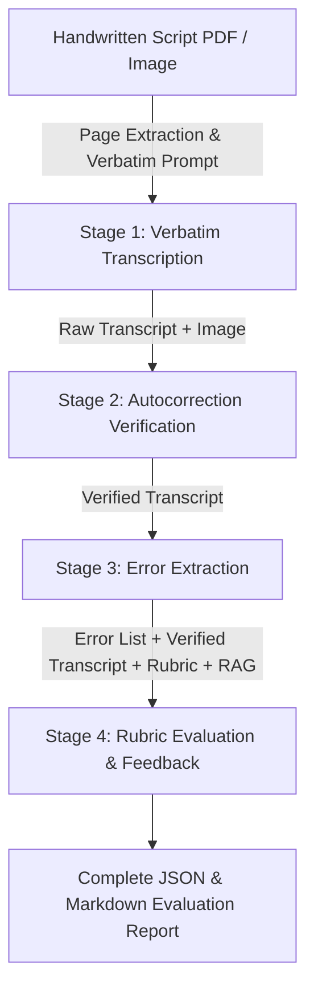

# Multimodal Exam Script Checking Pipeline (Gemma 4 31B IT)

An automated 4-stage multimodal evaluation pipeline for handwritten exam scripts powered by **Gemma 4 31B IT** with local CUDA acceleration and direct PDF input processing.

---

## 📂 Google Drive Dataset & Smart Caching

The raw handwritten script PDFs are hosted at:
> [Google Drive Folder](https://drive.google.com/drive/folders/11spWhJTncBfM_qsOvpH17AgduhyQpqSN)

The pipeline includes built-in smart caching:
- PDFs are downloaded locally into `data/raw_pdfs/`.
- **Already downloaded PDFs are automatically detected and NOT redownloaded.**
- Use `--top N` to control how many PDF scripts to download and evaluate in one batch.

---

## 🚀 4-Stage Pipeline Architecture



### Stage-by-Stage Output Hierarchy:
Every script run creates a dedicated folder with intermediate artifacts at every stage:
```
outputs/runs/<script_id>/
  ├── stage1_transcription.json        # Stage 1 metrics, tags & character stats
  ├── stage1_raw_transcript.txt        # Exact raw verbatim text
  ├── stage2_verification.json         # Reverted silent autocorrection diffs
  ├── stage2_verified_transcript.txt   # Canonical verified transcript
  ├── stage3_errors.json               # Structured error catalog
  ├── stage3_errors.csv                # Tabular error list (spelling, grammar, syntax)
  ├── stage4_evaluation.json           # Rubric marks breakdown & deductions
  ├── complete_report.json             # Consolidated 4-stage report
  └── evaluation_report.md             # Human-readable GitHub Markdown report
```

---

## 💻 Top Controller Usage (`scripts/process_scripts.py`)

### 1. Fast Local Development (Mock Engine on Your Current PC)
```bash
# Process top 3 PDFs from Google Drive with Mock simulation engine:
python scripts/process_scripts.py --top 3 --mock

# Download all PDFs only (without evaluating):
python scripts/process_scripts.py --download-only

# Process top 5 PDFs with Thinking Mode ablation:
python scripts/process_scripts.py --top 5 --mock --thinking
```

### 2. Production Run on NVIDIA RTX 5090 (32GB VRAM)
```bash
# Verify GPU environment and VRAM
python scripts/setup_env.py

# Process top 10 PDF scripts on CUDA with Gemma 4 31B IT (4-bit NF4)
python scripts/process_scripts.py --top 10 --model google/gemma-4-31b-it --quant 4bit

# Process all available PDFs from Google Drive
python scripts/process_scripts.py --quant 4bit
```

---

## ⚙️ Configuration (`configs/pipeline_config.yaml`)

```yaml
model:
  model_id: "google/gemma-4-31b-it"
  torch_dtype: "bfloat16"
  quantization: "4bit"  # 4-bit NF4 (~18-20GB VRAM footprint), 8-bit, or none
  device_map: "auto"

decoding:
  temperature: 0.0      # Greedy decoding
  top_p: 0.1
  max_new_tokens: 4096
  thinking_mode: false  # Ablation flag: validate reasoning on vs. off
```

---

## 🧪 Running Unit Tests
```bash
pytest
```
