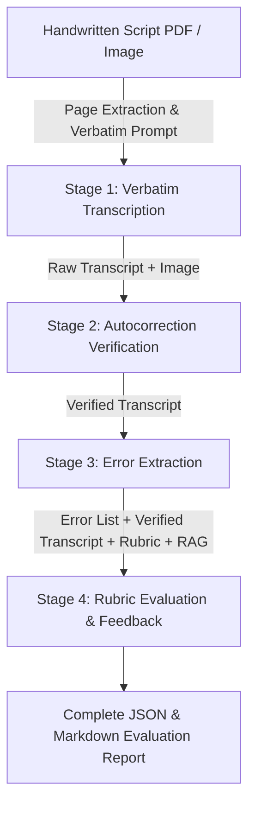

# Multimodal Exam Script Checking Pipeline (Gemma 4 31B IT)

An automated 4-stage multimodal evaluation pipeline for handwritten exam scripts powered by **Gemma 4 31B IT** with local CUDA acceleration and direct PDF input processing.

---

## 📂 Google Drive Dataset & Smart Caching

The raw handwritten script PDFs are hosted at:
> [Google Drive Folder](https://drive.google.com/drive/folders/11spWhJTncBfM_qsOvpH17AgduhyQpqSN)

The pipeline includes built-in smart caching:
- PDFs are downloaded locally into `data/raw_pdfs/`.
- **Already downloaded PDFs are automatically detected and NOT redownloaded.**
- Use `--top N` to control how many PDF scripts to download and evaluate in one batch.

---

## 🚀 4-Stage Pipeline Architecture



### Stage-by-Stage Output Hierarchy:
Every script run creates a dedicated folder with intermediate artifacts at every stage:
```
outputs/runs/<script_id>/
  ├── stage1_transcription.json        # Stage 1 metrics, tags & character stats
  ├── stage1_raw_transcript.txt        # Exact raw verbatim text
  ├── stage2_verification.json         # Reverted silent autocorrection diffs
  ├── stage2_verified_transcript.txt   # Canonical verified transcript
  ├── stage3_errors.json               # Structured error catalog
  ├── stage3_errors.csv                # Tabular error list (spelling, grammar, syntax)
  ├── stage4_evaluation.json           # Rubric marks breakdown & deductions
  ├── complete_report.json             # Consolidated 4-stage report
  └── evaluation_report.md             # Human-readable GitHub Markdown report
```

---

## 💻 Modular Workflow: Separate Extraction & Evaluation

To decouple the vision-heavy extraction from rubric evaluation:

### 1. Step 1: Run Extraction (`scripts/extract_scripts.py`)
Runs Stages 1 to 3: verbatim transcription, visual cross-verification to audit silent autocorrection, and linguistic error extraction. Saves all writing and error tables to disk.

```bash
# Interactive setup:
python scripts/extract_scripts.py

# Extract top 5 scripts on GPU:
python scripts/extract_scripts.py --lang bangla --top 5 --quant 4bit

# Fast Mock mode on development PC:
python scripts/extract_scripts.py --lang bangla --top 3 --mock
```

### 2. Step 2: Run Evaluation (`scripts/evaluate_scripts.py`)
Runs Stage 4: loads pre-extracted writing and error catalogs, scores criteria against subject rubrics, applies linguistic error penalties, and generates pedagogical reports.

```bash
# Evaluate a specific script by name:
python scripts/evaluate_scripts.py --script-name sample_bangla_01 --lang bangla

# Evaluate top N extracted scripts from directory:
python scripts/evaluate_scripts.py --top 5 --lang bangla

# Re-grade with a custom rubric without re-running vision extraction:
python scripts/evaluate_scripts.py --rubric configs/rubrics/bangla_creative_question.yaml --force-evaluate
```

---

## 🚀 Unified Controller Usage (`scripts/process_scripts.py`)

For end-to-end processing of all 4 stages in a single command:

```bash
# Run interactive wizard:
python scripts/process_scripts.py

# Top 10 scripts with 4-bit quantization on RTX 5090:
python scripts/process_scripts.py --lang bangla --top 10 --quant 4bit
```

---

## ⚙️ Configuration (`configs/pipeline_config.yaml`)

```yaml
model:
  model_id: "google/gemma-4-31b-it"
  torch_dtype: "bfloat16"
  quantization: "4bit"  # 4-bit NF4 (~18-20GB VRAM footprint), 8-bit, or none
  device_map: "auto"

decoding:
  temperature: 0.0      # Greedy decoding
  top_p: 0.1
  max_new_tokens: 4096
  thinking_mode: false  # Ablation flag: validate reasoning on vs. off
```

---

## 🧪 Running Unit Tests
```bash
pytest
```
