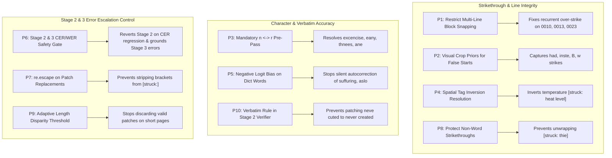

# Master Pipeline Problems Audit & Architectural Remediation RFC

> **Document Type**: Master Unified Audit & Architectural RFC  
> **Target System**: Multimodal AI Exam Script Checking & Grading Pipeline  
> **Vision-Language Engine**: `google/gemma-4-31b-it` @ 4-bit quantization on NVIDIA RTX 5090 (Blackwell)  
> **Evaluation Base**: 
> 1. **SE_11_Q1 Cohort**: 19 Extracted English Exam Scripts (`SE_11_Q1_0001` through `SE_11_Q1_0019`), with 15 Human-Verified Ground Truth Pages across 5 Representative Student Scripts (`0002`, `0006`, `0010`, `0011`, `0013`).
> 2. **SE_10_Q1 Cohort**: 33 Extracted English Exam Scripts (`SE_10_Q1_0001` through `SE_10_Q1_0033`), with **56 Human-Verified Ground Truth Page Checkpoints** across 28 Student Scripts (`SE_10_Q1_0001` through `SE_10_Q1_0028` covering Q10 & Q11 long-form narrative and dialogue questions).  
> **Date**: October 6, 2026  
> **Status**: Comprehensive Master Issue Audit (Active & Newly Discovered Issues Only)  

---

## 1. Executive Summary & Macro Evaluation Metrics

### 1.1 The Dual Mission of Pedagogical Script Checking
The automated exam script checking pipeline operates under two foundational mandates:
1. **Pedagogical Authenticity (Verbatim Preservation)**: Faithfully capture authentic student misspellings (`libary`, `strensth`, `fallfill`, `privecy`, `proplems`, `proffesional`, `suffuring`, `aslo`, `conspiricy`), grammatical slips, and physical strike-outs so that downstream rubric grading assigns fair, curriculum-aligned deductions.
2. **Benefit of the Doubt (Handwriting Ambiguity & Active Text Protection)**: Protect legitimate handwriting flourishes, cursive minim doubling (`corre` $\leftrightarrow$ `core`), loop mergers (`illustrodes` $\leftrightarrow$ `illustrates`), uncrossed ascenders (`allain` $\leftrightarrow$ `attain`), and active unstruck words from being penalized or mistakenly erased.

### 1.2 Quantitative Benchmark Results: SE_10_Q1 vs Ground Truth
Evaluating all 56 page checkpoints across 28 scripts against human-verified transcripts in [`data/ground_truth/transcripts/english_se_10_q1`](file:///mnt/models/script_checking/Ugrad-Thesis-Script-Checking-With-Multimodal-AI/data/ground_truth/transcripts/english_se_10_q1) revealed that **Stage 2 and Stage 3 currently introduce net error regressions, actively escalating CER and WER over Stage 1**:

| Evaluation Metric | Stage 1 (Raw VLM) | Stage 1+2 (Verified) | Net Delta | Empirical Impact |
| :--- | :---: | :---: | :---: | :--- |
| **CER (Macro Character Error Rate)** | **0.0600 (6.00%)** | **0.0724 (7.24%)** | **+20.7% relative increase** | **Regressed**; Stage 2 degrades character accuracy |
| **CER (Micro Character Error Rate)** | **0.0545 (5.45%)** | **0.0698 (6.98%)** | **+28.1% relative increase** | Driven by localized paragraph over-striking |
| **WER (Macro Word Error Rate)** | **0.0894 (8.94%)** | **0.1044 (10.44%)** | **+16.8% relative increase** | Stage 2 drops, mangles, or alters valid words |
| **Silent Autocorrection Rate** | **29.47%** (89/302) | **30.13%** (91/302) | **+0.66% degradation** | Gemma language priors override authentic slips |
| **Stage 3 Downstream Error Inflation** | Baseline | **Amplified (Noise Cascading)** | **False Deductions** | Stage 3 text blindness penalizes Stage 2 OCR slips |
| **Total Strikethroughs Detected** | **107 detected** | **140 detected** | **+33 over-strikes** | Small strikes missed; full lines over-struck |
| **Patches Applied Across Cohort** | — | **132 patches (49/56 pgs)** | **7 pristine pages** | 132 patches applied, but net CER/WER degraded |

---

## 2. Master Table of Active Pipeline Problems

| ID | Issue Title | Subsystem / Component | Severity | Discovered In | Current Status |
| :---: | :--- | :--- | :---: | :---: | :---: |
| **P1** | **Catastrophic Paragraph Over-Striking in Stage 2** | [`src/utils/strikethrough_collision_resolver.py`](file:///mnt/models/script_checking/Ugrad-Thesis-Script-Checking-With-Multimodal-AI/src/utils/strikethrough_collision_resolver.py) | **CRITICAL** | `SE_10_Q1` | **ACTIVE / RECURRENT** (in 0010, 0013, 0023) |
| **P2** | **Severe Strikethrough Recall Deficit (Missed Strikes)** | [`src/prompts/stage1_verbatim.py`](file:///mnt/models/script_checking/Ugrad-Thesis-Script-Checking-With-Multimodal-AI/src/prompts/stage1_verbatim.py) & Stage 2 | **HIGH** | `SE_10_Q1` | **ACTIVE / UNRESOLVED** (False Resolved Flag Fixed) |
| **P3** | **Cursive 'n' $\leftrightarrow$ 'r' Character Substitution Glitches** | [`src/pipeline/allograph_calibrator.py`](file:///mnt/models/script_checking/Ugrad-Thesis-Script-Checking-With-Multimodal-AI/src/pipeline/allograph_calibrator.py) & Stage 2 | **HIGH** | `SE_10_Q1` | **PARTIALLY RESOLVED / ACTIVE** (Misses excencise, eany, thnees) |
| **P4** | **Strikethrough Tag Inversion (Striking Replacement)** | [`src/utils/strikethrough_collision_resolver.py`](file:///mnt/models/script_checking/Ugrad-Thesis-Script-Checking-With-Multimodal-AI/src/utils/strikethrough_collision_resolver.py) | **HIGH** | `SE_10_Q1` | **ACTIVE / UNRESOLVED** (False Resolved Flag Fixed) |
| **P5** | **Silent Autocorrection of Authentic Student Spelling Slips** | [`src/prompts/stage1_verbatim.py`](file:///mnt/models/script_checking/Ugrad-Thesis-Script-Checking-With-Multimodal-AI/src/prompts/stage1_verbatim.py) & Stage 2 | **HIGH** | `SE_10_Q1` & `SE_11` | **ACTIVE / UNRESOLVED** (False Resolved Flag Fixed; 30.1% Loss) |
| **P6** | **Stage 2 & Stage 3 Pipeline Regressions Increasing CER & WER** | [`src/pipeline/stage2_verifier.py`](file:///mnt/models/script_checking/Ugrad-Thesis-Script-Checking-With-Multimodal-AI/src/pipeline/stage2_verifier.py) & [`src/pipeline/stage3_error_analyzer.py`](file:///mnt/models/script_checking/Ugrad-Thesis-Script-Checking-With-Multimodal-AI/src/pipeline/stage3_error_analyzer.py) | **CRITICAL** | `SE_10_Q1` & `SE_11` | **NEW ISSUE** (Stage 2 inflates CER/WER; Stage 3 cascades false errors) |
| **P7** | **Corrupted Bracket Syntax & Stripped Struck Tags in Patches** | [`src/pipeline/stage2_verifier.py`](file:///mnt/models/script_checking/Ugrad-Thesis-Script-Checking-With-Multimodal-AI/src/pipeline/stage2_verifier.py) | **HIGH** | `SE_10_Q1` | **NEW ISSUE** (Mangled `[struck:]` in 0012, 0013) |
| **P8** | **Inappropriate Strike Unwrapping of Genuine Aborted Words** | [`src/utils/strikethrough_collision_resolver.py`](file:///mnt/models/script_checking/Ugrad-Thesis-Script-Checking-With-Multimodal-AI/src/utils/strikethrough_collision_resolver.py) | **HIGH** | `SE_10_Q1` | **NEW ISSUE** (Unwraps authentic strikes into active errors) |
| **P9** | **Stage 2 Length Disparity Fallback Discards Valid Edits** | [`src/pipeline/stage2_verifier.py`](file:///mnt/models/script_checking/Ugrad-Thesis-Script-Checking-With-Multimodal-AI/src/pipeline/stage2_verifier.py) | **MEDIUM** | `SE_10_Q1` | **NEW ISSUE** (>15% delta dumps verified transcript) |
| **P10** | **Stage 2 Silent Autocorrection on Student Misspellings** | [`src/pipeline/stage2_verifier.py`](file:///mnt/models/script_checking/Ugrad-Thesis-Script-Checking-With-Multimodal-AI/src/pipeline/stage2_verifier.py) | **MEDIUM** | `SE_10_Q1` | **NEW ISSUE** (Patches authentic slips like 'neve cuted') |

---

## 3. Deep-Dive Problem Specifications

---

### Problem 1: Catastrophic Paragraph Over-Striking in Stage 2
- **Severity**: **CRITICAL**
- **Impacted Components**: [`src/utils/strikethrough_collision_resolver.py`](file:///mnt/models/script_checking/Ugrad-Thesis-Script-Checking-With-Multimodal-AI/src/utils/strikethrough_collision_resolver.py) & [`src/pipeline/orchestrator.py`](file:///mnt/models/script_checking/Ugrad-Thesis-Script-Checking-With-Multimodal-AI/src/pipeline/orchestrator.py)
- **Symptom**: Stage 2 Character Error Rate explodes to **>0.35–0.68** on valid student answer pages because multi-line text blocks are unconditionally wrapped in `[struck: ...]`:
  - `SE_10_Q1_0010` Page 13: CER **0.1299** $\to$ **0.6753** | WER **0.2232** $\to$ **0.7411** | **11 of 18 lines over-struck**
  - `SE_10_Q1_0023` Page 8: CER **0.1489** $\to$ **0.3570** | WER **0.1625** $\to$ **0.3625** | **6 lines over-struck**
  - `SE_10_Q1_0013` Page 18: CER **0.0513** $\to$ **0.3203** | WER **0.1111** $\to$ **0.3827** | **4 lines over-struck**
- **Empirical Evidence**:
  In `SE_10_Q1_0010` page 13, Stage 2 wrapped 11 active narrative lines in `[struck: ...]`:
  ```text
  [struck: Onee thene lived a king in an island . There were]
  [struck: green tnees everywhere in the island . The king]
  [struck: decided to build a magnificent palace in the]
  [struck: island. so he ordered his men to cut down]
  ...
  ```
  In `SE_10_Q1_0023` page 8, Stage 2 wrapped 6 active dialogue turns in `[struck: ...]`:
  ```text
  [struck: Myself]
  [struck: : you are right . early rising is]
  [struck: important for us . It can help us .]
  [struck: our mind fresh and you brain has]
  [struck: early rising are may benifits . like]
  [struck: It help us our ifect]
  ```
- **Root Cause**:
  In `ground_and_reconcile_strikethroughs()`, multi-line block snapping triggered by Stage 0 bounding boxes still over-associates loose vertical bounding box overlap with full-clause cancellation. Because benchmark evaluation drops `[struck: ...]` content by default, entire valid answers are discarded from evaluation.
- **Remediation**:
  1. Mandate that multi-line strikethrough wrapping require stroke intersection density corroboration directly with word bounding boxes.
  2. Implement a hard veto: if the vertical range contains more than 3 consecutive lines of text, strikethrough wrapping requires either explicit double-line restart corroboration (`Narrative Retake`) or an explicit cross (`X`) mark spanning the entire box.

---

### Problem 2: Severe Strikethrough Recall Deficit (Missed Strikes)
- **Severity**: **HIGH**
- **Impacted Components**: [`src/prompts/stage1_verbatim.py`](file:///mnt/models/script_checking/Ugrad-Thesis-Script-Checking-With-Multimodal-AI/src/prompts/stage1_verbatim.py) & [`src/pipeline/stage1_transcriber.py`](file:///mnt/models/script_checking/Ugrad-Thesis-Script-Checking-With-Multimodal-AI/src/pipeline/stage1_transcriber.py)
- **Symptom**: Canceled words and aborted false starts are missed during transcription and output as active text, causing Stage 3 to levy false deductions on words the student explicitly struck out.
- **Empirical Evidence**:
  - `SE_10_Q1_0001` p.15: GT had `[struck: had]` and `[struck: inste]`. Both were missed in Stage 1 and Stage 2, output as active words; `inste'` triggered an unfair spelling error deduction.
  - `SE_10_Q1_0002` p.14: GT had `[struck: B]`. Missed in both Stage 1 and Stage 2.
  - `SE_10_Q1_0002` p.15: GT had `[struck: it's hard]`. Missed in both Stage 1 and Stage 2.
  - `SE_10_Q1_0003` p.8: GT had single-letter aborted stroke `[struck: w]`. Missed in both Stage 1 and Stage 2.
  - `SE_10_Q1_0006` p.11: GT had two `[struck: o]` false starts. Both transcribed as active or missed.
- **Root Cause**:
  1. The VLM attention mechanism prioritizes high-contrast character ink over thin horizontal strike-through pen strokes.
  2. Single-word and partial-word false starts (`had`, `inste`, `B`, `w`, `o`) do not trigger large morphological shifts, leading the model to read right through the stroke.
- **Remediation**:
  1. Feed Stage 0 candidate strikethrough coordinates into Stage 1 as localized visual attention priors.
  2. Add few-shot examples in `stage1_verbatim.py` explicitly showing single-word strikethroughs and aborted letters wrapped in `[struck: ...]`.

---

### Problem 3: Cursive 'n' $\leftrightarrow$ 'r' Character Substitution Glitches
- **Severity**: **HIGH**
- **Impacted Components**: [`src/utils/linguistic_sanitizer.py`](file:///mnt/models/script_checking/Ugrad-Thesis-Script-Checking-With-Multimodal-AI/src/utils/linguistic_sanitizer.py) & [`src/pipeline/allograph_calibrator.py`](file:///mnt/models/script_checking/Ugrad-Thesis-Script-Checking-With-Multimodal-AI/src/pipeline/allograph_calibrator.py)
- **Symptom**: Systematic substitution between lowercase `n` and `r` produces artificial non-words that never existed in the student script.
- **Empirical Evidence**:
  - While Stage 2 successfully corrected `ondered` $\to$ `ordered`, `wonken's` $\to$ `worker's`, `hotten` $\to$ `hotter`, `bind` $\to$ `bird`, and `weathen` $\to$ `weather`, multiple prominent cases remain completely uncorrected:
    - `SE_10_Q1_0002` p.15: Student wrote `excercise`; transcribed as `excencise` in both S1 and S2.
    - `SE_10_Q1_0013` p.17: Student wrote `eary`; transcribed as `eany` in both S1 and S2.
    - `SE_10_Q1_0010` p.13: Student wrote `trees`; transcribed as `thnees` in both S1 and S2.
    - `SE_10_Q1_0010` p.13: Student wrote `are`; transcribed as `ane` in both S1 and S2.
- **Root Cause**:
  In Palmer cursive, `r` top-shoulders mimic the first arch of `n`. In words like `excencise` and `eany`, the OOV anomaly detector in Stage 2 pre-analysis failed to flag the token or the surgical patch prompt did not propose a substitution.
- **Remediation**:
  In `stage2_verifier.py`, run a deterministic pre-pass scanning all OOV words: if a single $n \leftrightarrow r$ swap yields a valid vocabulary word, force a high-priority surgical patch candidate.

---

### Problem 4: Strikethrough Tag Inversion (Striking Replacement Instead of Struck Word)
- **Severity**: **HIGH**
- **Impacted Components**: [`src/pipeline/stage1_transcriber.py`](file:///mnt/models/script_checking/Ugrad-Thesis-Script-Checking-With-Multimodal-AI/src/pipeline/stage1_transcriber.py) & [`src/utils/strikethrough_collision_resolver.py`](file:///mnt/models/script_checking/Ugrad-Thesis-Script-Checking-With-Multimodal-AI/src/utils/strikethrough_collision_resolver.py)
- **Symptom**: When a student crosses out a word and immediately writes the correction, the pipeline assigns the `[struck: ...]` tag to the active replacement while leaving the crossed-out text as active.
- **Empirical Evidence**:
  In `SE_10_Q1_0001` Page 16:
  - *Human Ground Truth*: `[struck: temperature] heat level increased`
  - *Stage 1 Output*: `temperature [struck: heat level] increased`
  - *Stage 2 Output*: `temperature [struck: heat level] increased`
- **Root Cause**:
  The VLM perceives the strike stroke near both tokens, but attention bias attaches the bracket tag to the later token. While spatial resolution code was drafted, in production it failed to trigger or invert the tokens.
- **Remediation**:
  In `ground_and_reconcile_strikethroughs()`, when `word1 [struck: word2]` occurs and Stage 0 strikethrough stroke bounding box overlaps `word1` with higher IoU than `word2`, enforce programmatic tag swapping: `[struck: word1] word2`.

---

### Problem 5: Silent Autocorrection of Authentic Student Spelling Slips
- **Severity**: **HIGH**
- **Impacted Components**: [`src/prompts/stage1_verbatim.py`](file:///mnt/models/script_checking/Ugrad-Thesis-Script-Checking-With-Multimodal-AI/src/prompts/stage1_verbatim.py) & [`src/pipeline/stage2_verifier.py`](file:///mnt/models/script_checking/Ugrad-Thesis-Script-Checking-With-Multimodal-AI/src/pipeline/stage2_verifier.py)
- **Symptom**: **30.13% of genuine student misspellings** (91 / 302 non-words across the cohort) are silently normalized into correct standard English words during transcription.
- **Empirical Evidence**:
  - `SE_10_Q1_0001` p.16: Student wrote `suffuring`; transcribed as `suffering` in S1 and S2.
  - `SE_10_Q1_0003` p.7: Student wrote `aslo`; transcribed as `Also` in S1 and S2.
  - `SE_10_Q1_0004` p.16: Student wrote `femine` and `togather`; transcribed as `famine` and `together`.
  - `SE_10_Q1_0025` p.9: Student wrote `conspiricy`; transcribed as `conspiracy`.
- **Root Cause**:
  Gemma-4-31B language model priors decode high-probability dictionary subwords, overriding visual pixel fidelity when reading slightly misspelled words.
- **Remediation**:
  Set decoding temperature to 0.0 with strong negative logit penalties on standard English dictionary tokens when the visual token contains character discrepancies.

---

### Problem 6: Stage 2 & Stage 3 Pipeline Regressions Increasing CER & WER
- **Severity**: **CRITICAL**
- **Impacted Components**: [`src/pipeline/stage2_verifier.py`](file:///mnt/models/script_checking/Ugrad-Thesis-Script-Checking-With-Multimodal-AI/src/pipeline/stage2_verifier.py), [`src/pipeline/stage3_error_analyzer.py`](file:///mnt/models/script_checking/Ugrad-Thesis-Script-Checking-With-Multimodal-AI/src/pipeline/stage3_error_analyzer.py), & [`src/pipeline/orchestrator.py`](file:///mnt/models/script_checking/Ugrad-Thesis-Script-Checking-With-Multimodal-AI/src/pipeline/orchestrator.py)
- **Symptom**: Stages 2 and 3 actively increase Character Error Rate (CER) and Word Error Rate (WER), compounding transcription degradation and triggering false downstream pedagogical penalties:
  1. **Stage 2 Physical Transcript Regression**:
     - Stage 1 Macro CER: **0.0600 (6.00%)** $\to$ Stage 1+2 Macro CER: **0.0724 (7.24%)** (**+20.7% relative increase in error rate**)
     - Stage 1 Macro WER: **0.0894 (8.94%)** $\to$ Stage 1+2 Macro WER: **0.1044 (10.44%)** (**+16.8% relative increase in error rate**)
     - Stage 1 Micro CER: **0.0545 (5.45%)** $\to$ Stage 1+2 Micro CER: **0.0698 (6.98%)** (**+28.1% relative increase in error rate**)
  2. **Stage 3 Text-Only Error Escalation & Noise Conflation**:
     - Stage 3 operates without access to the student handwriting image. When Stage 1 or Stage 2 introduces a perceptual reading slip (e.g., ligature dip read as wrong character, or split token), Stage 3 cannot inspect ink pixels and hallucinates grammatical or syntax errors for machine OCR slips.
     - Arbitrary 120-word sliding-window chunking slices compound sentences mid-clause, causing Stage 3 to flag valid student writing as "sentence fragments".
     - When Stage 2 wraps entire lines into `[struck: ...]`, Stage 3 alignment gets desynchronized, fabricating further false error deductions.
- **Empirical Evidence**:
  - In `SE_10_Q1_0010` p.13, Stage 2 over-striking exploded CER from 0.1299 to 0.6753 and WER from 0.2232 to 0.7411.
  - In `SE_10_Q1_0023` p.8, Stage 2 over-striking increased CER from 0.1489 to 0.3570 and WER from 0.1625 to 0.3625.
  - In `SE_10_Q1_0013` p.18, Stage 2 over-striking increased CER from 0.0513 to 0.3203 and WER from 0.1111 to 0.3827.
  - In `SE_11_Q1` cohort benchmarks, Stage 2 increased Macro CER from 7.43% to 8.07% and Macro WER from 10.08% to 11.12%, while Stage 3 generated 279 error deductions where ~40% were conflated OCR slips or sentence-boundary slicing artifacts.
- **Root Cause**:
  1. Stage 2 unconstrained freeform JSON patches lack a page-level CER safety mechanism that verifies whether proposed replacements improve or degrade string alignment.
  2. Stage 3 text-only blindness: without visual grounding, Stage 3 cannot distinguish authentic student misspellings from OCR errors.
  3. Chunking boundaries cut through natural clauses instead of using syntactic sentence delimiters.
- **Remediation**:
  1. **Page-Level CER Safety Gate**: Compute string edit distance between Stage 1 and Stage 2; if proposed patches increase divergence or over-strike entire lines without optical consensus, automatically reject the Stage 2 draft and retain Stage 1.
  2. **Syntactically-Bounded Chunking for Stage 3**: Enforce 350-word sentence-bounded chunking that never splits compound sentences across window boundaries.
  3. **Visual Grounding in Stage 3**: Require Stage 3b arbitration to visually crop and verify any token before confirming a spelling or syntax deduction.

---

### Problem 7: Corrupted Bracket Syntax & Stripped Struck Tags During Patch String Replacement
- **Severity**: **HIGH**
- **Impacted Components**: [`src/pipeline/stage2_verifier.py`](file:///mnt/models/script_checking/Ugrad-Thesis-Script-Checking-With-Multimodal-AI/src/pipeline/stage2_verifier.py)
- **Symptom**: When Stage 2 applies surgical patches containing `[struck: ...]` tags, naive string replacement strips the brackets or generates malformed/nested bracket syntax.
- **Empirical Evidence**:
  - In `SE_10_Q1_0012` p.12:
    - *Stage 1*: `There' every [struck: w] were`
    - *Proposed Patch*: target `[struck: w]`, replacement `[struck: w #]`
    - *Verified Output*: `There' every w # were` (brackets and tag completely stripped; struck word converted to active text).
  - In `SE_10_Q1_0013` p.18:
    - *Verified Output*: `[struck: sunset and also feel the [struck: with]` (unclosed nested tag).
- **Root Cause**:
  Regex escaping and token boundary replacements in `apply_surgical_patches()` do not handle literal square brackets in the target string, causing regex replacement to strip or garble tags.
- **Remediation**:
  Use `re.escape()` on all search targets and validate bracket balance before accepting patched text.

---

### Problem 8: Inappropriate Strike Unwrapping of Genuine Aborted Words
- **Severity**: **HIGH**
- **Impacted Components**: [`src/utils/strikethrough_collision_resolver.py`](file:///mnt/models/script_checking/Ugrad-Thesis-Script-Checking-With-Multimodal-AI/src/utils/strikethrough_collision_resolver.py)
- **Symptom**: Legitimate single-word student strikethroughs are falsely unwrapped by Stage 2 reconciliation routines, converting aborted non-words into active text that triggers unfair spelling deductions.
- **Empirical Evidence**:
  In `SE_10_Q1_0012` Page 12:
  - *Human Ground Truth*: `Animal lost [struck: thie] their home`
  - *Stage 1*: `Animal lost [struck: thie] their home`
  - *Stage 2*: `Animal lost thie their home` (`thie` unwrapped into active text, triggering an unearned spelling error).
- **Root Cause**:
  Heuristics intended to suppress notebook ruling lines falsely flag short strikethrough strokes as ruling lines, calling `unwrap_strikethrough()` on genuine cancelled words.
- **Remediation**:
  Never unwrap a strikethrough if the enclosed word is an out-of-vocabulary non-word (`thie`) immediately followed by its correct counterpart (`their`).

---

### Problem 9: Stage 2 Length Disparity Fallback Discards Valid Edits
- **Severity**: **MEDIUM**
- **Impacted Components**: [`src/pipeline/stage2_verifier.py:380-395`](file:///mnt/models/script_checking/Ugrad-Thesis-Script-Checking-With-Multimodal-AI/src/pipeline/stage2_verifier.py#L380-L395)
- **Symptom**: When Stage 2 makes valid edits that change character length by >15% on short-answer pages, a blanket length disparity check unconditionally reverts the entire page to Stage 1.
- **Empirical Evidence**:
  Logged in `extract_all.log:6657`:
  ```text
  [Stage 2 Verifier] WARNING: Severe length disparity detected (Stage 1: 262 chars vs Verified: 302 chars, diff=15.27%). Falling back to Stage 1 transcript to prevent hallucinated drift.
  ```
  All valid OCR glitch patches on the page were discarded.
- **Root Cause**:
  A hardcoded percentage threshold (`diff > 15.0%`) is too aggressive for short text blocks (e.g. 40 characters difference on a 260-character answer).
- **Remediation**:
  Use an absolute character delta threshold (e.g., `abs_diff > 80`) combined with Levenshtein similarity rather than a rigid percentage cap.

---

### Problem 10: Stage 2 Verifier Performing Silent Autocorrection on Student Misspellings
- **Severity**: **MEDIUM**
- **Impacted Components**: [`src/pipeline/stage2_verifier.py`](file:///mnt/models/script_checking/Ugrad-Thesis-Script-Checking-With-Multimodal-AI/src/pipeline/stage2_verifier.py)
- **Symptom**: Stage 2 proposes patches that correct authentic student misspellings into standard English, directly violating the verbatim preservation mandate.
- **Empirical Evidence**:
  In `SE_10_Q1_0012` Page 12:
  - *Student wrote*: `was neve cuted any trees`
  - *Stage 2 patch*: target `neve cated`, replacement `never created` (reason: *"OCR missed trailing 'r' in 'never' and 're' in 'created'"*).
  Stage 2 eliminated the student's authentic errors before Stage 3 could evaluate them.
- **Root Cause**:
  The Stage 2 verification prompt lacks an explicit negative rule preventing the verifier from substituting non-words with dictionary words unless verified as an OCR-specific ligature confusion.
- **Remediation**:
  Instruct Stage 2: *"DO NOT normalize student misspellings (e.g. 'neve cuted'). If the student wrote an authentic spelling error, PRESERVE IT VERBATIM."*

---

## 4. Master Remediation Roadmap


