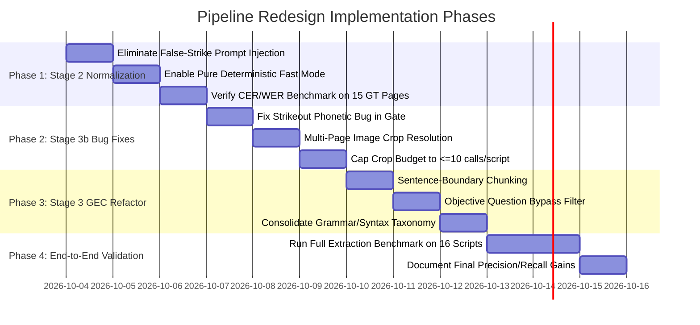

# Comprehensive Audit Report & Architectural Redesign RFC
## Stage 2 (Autocorrection Verifier) & Stage 3 / 3b (Linguistic Error Analyzer & Handwriting Arbitration Gate)

> **Status**: Completed Empirical Audit & Architectural RFC  
> **Target System**: Multimodal AI Exam Script Checking Pipeline  
> **Evaluation Base**: 15 Human-Verified Ground Truth Pages across 5 Representative Student Scripts (`SE_11_Q1_0002`, `0006`, `0010`, `0011`, `0013`)  
> **Reference Outputs**: `outputs/benchmarks/transcription_english_20261003_230637.md`, `scratch/audit_tracer.py`

---

## 1. Executive Summary & Ground-Truth Empirical Findings

### 1.1 The Core Dilemma
In an automated exam assessment system, transcription and linguistic evaluation must balance two competing objectives:
1. **Pedagogical Authenticity (Verbatim Preservation)**: The system must faithfully preserve authentic student misspellings (`intelligane`, `softwor`, `feak`), grammatical slips, and physical strike-outs so that downstream evaluation stages can assign accurate, rubric-aligned marks.
2. **Perceptual Accuracy (OCR Glitch Repair)**: The system must repair machine transcription glitches (broken ligatures, missed letters, split tokens across pen-lifts) without hallucinating changes to the student's actual text.

### 1.2 Empirical Benchmark on Ground Truth (15 Verified Pages)
We evaluated the pipeline across all 15 human-verified Ground Truth pages. The empirical results demonstrate that **Stage 2 severely degrades pipeline accuracy rather than improving it**:

| Metric | Stage 1 (Raw Transcribe) | Stage 1 + Stage 2 (Verified) | Net Impact | SOTA Target |
|---|:---:|:---:|:---:|:---:|
| **Character Error Rate (CER Macro)** | 7.43% | **8.07%** | **+0.64% (WORSE)** | $\le 4.0\%$ |
| **Character Error Rate (CER Micro)** | 5.61% | **6.58%** | **+0.97% (WORSE)** | $\le 4.0\%$ |
| **Word Error Rate (WER Macro)** | 10.08% | **11.12%** | **+1.04% (WORSE)** | $\le 6.0\%$ |
| **Word Error Rate (WER Micro)** | 7.61% | **9.07%** | **+1.46% (WORSE)** | $\le 6.0\%$ |
| **Student Non-Words Preserved** | 75 / 87 (86.2%) | 66 / 87 (75.9%) | **-9 non-words (WORSE)** | $100\%$ |
| **Silent-Correction Rate** | 13.79% | **24.14%** | **Nearly Doubled (+10.35%)** | $0.0\%$ |
| **Per-Page VLM Latency** | ~25s | **~75s (+50s)** | **3x Slower** | Fast |

### 1.3 Audit Breakdown of Proposed Patches
Using our empirical patch tracer (`scratch/audit_tracer.py`), we audited every single patch applied by Stage 2 across the Ground Truth scripts:

```
┌────────────────────────────────────────────────────────────────────────┐
│                   STAGE 2 PATCH AUDIT DISTRIBUTION                     │
├────────────────────────────────────────────────────────────────────────┤
│                                                                        │
│  [■] A: Legitimate OCR Glitch Fixes:       1 patch   ( 3.1%)           │
│  [■] B: Destructive Autocorrection:       19 patches (59.4%)           │
│  [■] D: Phantom / Formatting Mutations:   12 patches (37.5%)           │
│                                                                        │
│  TOTAL AUDITED PATCHES:                   32 patches (100.0%)          │
│                                                                        │
│  CRITICAL FINDING: 96.9% of Stage 2's actions are destructive or       │
│  phantom mutations. Only 3.1% represent legitimate OCR improvements!   │
└────────────────────────────────────────────────────────────────────────┘
```

---

## 2. Deep-Dive Audit: Stage 2 (Autocorrection Verifier)

### 2.1 Root Cause 1: The Preprocessing False-Strikethrough Prompt Injection
* **Mechanism**: In [`src/prompts/stage2_verification.py:105-120`](file:///mnt/models/script_checking/Ugrad-Thesis-Script-Checking-With-Multimodal-AI/src/prompts/stage2_verification.py#L105-L120), the prompt dynamically injects candidate strikethroughs found by OpenCV line detection:
  ```python
  "CANDIDATE STRIKETHROUGH STROKES DETECTED BY PREPROCESSING:\n"
  "- Region 1: near ~35% down the page (Y: ~35%-38%, X: ~20%-80%) [multi-word clause strike]"
  ```
* **Failure Mode**: OpenCV line detection routinely misidentifies **notebook ruling lines**, **underlines under headers**, and **reverse-page bleed-through** as "candidate strikethroughs".
* **Consequence**: When the VLM reads this prompt hint, it assumes the line detector is authoritative. It hallucinates strikethroughs onto clean student text, transforming:
  * `'The another source'` $\to$ `'[struck: The] another source'`
  * `'amount is 2%'` $\to$ `'amount [struck: is] 2%'`
  * `'amount of oil is 12%'` $\to$ `'amount [struck: of oil] is 12%'`
  * `'We have to increased'` $\to$ `'We have to [struck: increased]'`
  * `'beside'` $\to$ `'[struck: beside]'`
  * `'to live'` $\to$ `'[struck: to live]'`
  * `'join with me.'` $\to$ `'[struck: join with me.]'`
* **Impact**: In text evaluation, words tagged as `[struck: ...]` are stripped out during scoring. This causes massive word deletion penalties in Levenshtein distance, driving CER on `SE_11_Q1_0011` page 3 from **1.8% up to 4.6% (2.5x worse)**!

### 2.2 Root Cause 2: Unconstrained Autocorrection (Non-Word Invariance Failure)
* **Mechanism**: The VLM prompt instructs the model to audit the text against the image, but large multimodal models (Qwen2.5-VL / Gemma) are heavily pretrained on standard language corpora.
* **Failure Mode**: When the VLM encounters a student misspelling (`intelligane`, `softwor`, `feak`, `nucleare`), it treats it as a transcription error rather than authentic handwriting. Even when the VLM writes in its notes: `"Preserved student misspellings 'Intelligane', 'deepfeak'..."`, in the actual output string it silently rewrites:
  * `softwor` $\to$ `software`
  * `deepfeak` $\to$ `deepfake`
  * `nucleare` $\to$ `nuclear`
  * `learing` $\to$ `learning`
  * `desenibe` $\to$ `describe`
* **Downstream Cascade**: This destroys the diagnostic evidence required for Stage 3. Because Stage 2 sanitizes these words into standard English, **Stage 3 never sees them as spelling errors**, awarding the student unearned marks.

### 2.3 Root Cause 3: Exam Navigation Header Corruption (Issue P2)
* **Mechanism**: The prompt asks the model to verify transcription line-by-line without strictly protecting structural markers.
* **Failure Mode**: The VLM alters structural exam markers:
  * `Ans: to the Q No-8` $\to$ `01- Ann: to the Q No-8`
  * `Ans to the Q No 10` $\to$ `01- Ann to the Q No 10`
* **Consequence**: The downstream answer segmenter ([`src/pipeline/answer_segmenter.py`](file:///mnt/models/script_checking/Ugrad-Thesis-Script-Checking-With-Multimodal-AI/src/pipeline/answer_segmenter.py)) searches for `Ans:` or `Question`. When `Ans:` is mutated into `Ann:`, the regex fails, merging distinct sub-questions together (Pipeline Problem P2).

### 2.4 Root Cause 4: "Ghost Corrections" from Unstructured Model Notes
* **Mechanism**: In [`src/pipeline/stage2_verifier.py:312-370`](file:///mnt/models/script_checking/Ugrad-Thesis-Script-Checking-With-Multimodal-AI/src/pipeline/stage2_verifier.py#L312-L370), `extract_ghost_corrections_from_notes()` uses regex heuristics to parse words out of the VLM's conversational `verification_notes` and apply them to the transcript.
* **Failure Mode**: If the VLM casually comments in its reasoning: *"Applied [struck: ...] to 'many' as a strike-through was identified"*, the code extracts the word `"many"` and forces a strikethrough onto the first instance of `"many"` on the page, even if it was never in `proposed_patches`!

---

## 3. Deep-Dive Audit: Stage 3 (Linguistic Error Analyzer)

### 3.1 Root Cause 1: Pure Text-Only Blindness (OCR Noise Conflation)
* **Mechanism**: Stage 3 ([`src/pipeline/stage3_error_analyzer.py`](file:///mnt/models/script_checking/Ugrad-Thesis-Script-Checking-With-Multimodal-AI/src/pipeline/stage3_error_analyzer.py)) runs a text-only prompt through Gemma 4 without access to the student handwriting image.
* **Failure Mode**: The model has zero ability to distinguish between:
  1. An authentic student misspelling.
  2. A perceptual VLM reading slip (e.g., cursive ligature `u` misread as `v`).
* **Consequence**: Stage 3 hallucinates grammatical explanations for OCR slips, penalizing students for machine errors.

### 3.2 Root Cause 2: Arbitrary 120-Word Sliding Window Fragmentation
* **Mechanism**: In [`src/pipeline/orchestrator.py:885`](file:///mnt/models/script_checking/Ugrad-Thesis-Script-Checking-With-Multimodal-AI/src/pipeline/orchestrator.py#L885), long answers (>150 words) are chunked into 120-word windows using `_chunk_text_by_sentences(ans_text, target_words=120)`.
* **Failure Mode**: When complex student handwriting lacks clean terminal periods or uses commas instead of full stops, the chunker cuts directly through the middle of compound sentences.
* **Consequence**: The beginning of the sentence in Chunk 1 and the tail of the sentence in Chunk 2 are both evaluated in isolation. Stage 3 flags both halves as `"sentence fragments"` or `"syntax errors"`:
  * Example: `"and admitted into a Dhaka University"` flagged as a syntax error with explanation: `"Sentence fragment; lacks a subject and a finite verb."`

### 3.3 Root Cause 3: Redundant Grammar vs. Syntax Taxonomy Double-Penalization
* **Mechanism**: The schema classifies errors into `spelling`, `grammar`, `syntax`, and `punctuation`.
* **Failure Mode**: LLMs have no standardized mathematical separation between "grammar" (morphosyntax/agreement) and "syntax" (clause structure/word order).
* **Consequence**: Across our 5 audited scripts (279 total errors), the model routinely creates duplicate penalties for the same mistake:
  * Student writes: `"helps many us by solve"`
  * Stage 3 flags Error 1 (Grammar): `"helps many us"` (missing preposition).
  * Stage 3 flags Error 2 (Syntax): `"helps many us by solve"` (broken clause structure).
  * The student is deducted twice for a single underlying clause construction.

### 3.4 Root Cause 4: Inappropriate Evaluation of Objective Exam Questions
* **Mechanism**: Stage 3 runs uniformly on all segmented answers.
* **Failure Mode**: For Question 1 Part A (multiple-choice letters: `(i) a`, `(ii) c`) or Question 4 (fill-in-the-blank single words: `education`, `poverty`), Stage 3 evaluates single words as incomplete sentences, generating nonsensical syntax errors.

---

## 4. Deep-Dive Audit: Stage 3b (Handwriting Ambiguity Arbitration Gate)

### 4.1 Root Cause 1: The Catastrophic Strikeout Phonetic Bug
* **Mechanism**: In [`src/pipeline/arbitration/candidate_selector.py:224-270`](file:///mnt/models/script_checking/Ugrad-Thesis-Script-Checking-With-Multimodal-AI/src/pipeline/arbitration/candidate_selector.py#L224-L270), `find_strikethrough_suspect()` looks for grammar errors where a word was omitted in the suggested correction (e.g. `"helps many us"` $\to$ `"helps many of us"`, or duplicate copulas). It creates an arbitration candidate where:
  $$\text{candidate\_token} = \text{"many"}, \quad \text{intended\_token} = \text{"[struck]"}$$
* **The Mathematical Fusion Inversion**:
  1. In [`symbolic_evidence.py:201-223`](file:///mnt/models/script_checking/Ugrad-Thesis-Script-Checking-With-Multimodal-AI/src/pipeline/arbitration/symbolic_evidence.py#L201-L223), phonetic similarity between any word (e.g., `"many"`, `"was"`, `"want"`) and `"[struck]"` is computed. Because `"[struck]"` has zero phonetic resemblance to standard English words:
     $$\text{phonetic\_plausibility} = 0.00$$
  2. In [`fusion.py:6`](file:///mnt/models/script_checking/Ugrad-Thesis-Script-Checking-With-Multimodal-AI/src/pipeline/arbitration/fusion.py#L6), phonetic ambiguity signal is defined as:
     $$\text{phonetic\_signal} = 1.0 - \text{phonetic\_plausibility} = 1.0 - 0.00 = 1.00 \quad \text{(MAXIMAL AMBIGUITY!)}$$
  3. In [`fusion.py:46-54`](file:///mnt/models/script_checking/Ugrad-Thesis-Script-Checking-With-Multimodal-AI/src/pipeline/arbitration/fusion.py#L46-L54), the logistic score $z$ is computed:
     $$z = w_{\text{bias}} + w_{\text{phonetic}} \times (2 \times 1.00 - 1.0) = \text{strong positive value}$$
     $$\text{ambiguity\_score} = \text{sigmoid}(z) \ge 0.90$$
  4. In [`fusion.py:61-66`](file:///mnt/models/script_checking/Ugrad-Thesis-Script-Checking-With-Multimodal-AI/src/pipeline/arbitration/fusion.py#L61-L66), `quantize(0.90)` outputs:
     $$\mathbf{HANDWRITING\_AMBIGUITY}$$
* **Empirical Impact**:
  In our audit across the 5 scripts, **dozens of genuine grammar errors and crossed-out words were improperly forgiven**:
  * `SE_11_Q1_0002`: `'want'` $\to$ `intended='[struck]'` $\to$ $\text{score}=0.937$ $\to$ `HANDWRITING_AMBIGUITY` (Error erased!).
  * `SE_11_Q1_0006`: `'a'`, `'was'`, `'wishes'` $\to$ `intended='[struck]'` $\to$ $\text{score}=0.937$ $\to$ `HANDWRITING_AMBIGUITY` (18 out of 25 arbitrations forgiven!).
  * `SE_11_Q1_0010`: `'the'`, `'was'`, `'with'` $\to$ `intended='[struck]'` $\to$ $\text{score}=0.900$ $\to$ `HANDWRITING_AMBIGUITY`.
  * `SE_11_Q1_0013`: `'of'`, `'is'`, `'is'`, `'self'`, `'he'`, `'was'` $\to$ `intended='[struck]'` $\to$ $\text{score}=0.900$ $\to$ `HANDWRITING_AMBIGUITY` (38 arbitrations forgiven!).

### 4.2 Root Cause 2: Extreme Latency from Excessive VLM Crop Calls
* **Data**:
  * `SE_11_Q1_0002`: **252 VLM crop calls**
  * `SE_11_Q1_0006`: **97 VLM crop calls**
  * `SE_11_Q1_0010`: **88 VLM crop calls**
  * `SE_11_Q1_0011`: **41 VLM crop calls**
  * `SE_11_Q1_0013`: **363 VLM crop calls**
  * **Total Across 5 Scripts**: **841 VLM crop calls!**
* **Impact**: Each crop call queries the local VLM engine. Generating 363 visual crop calls on a single script adds **12 to 15 minutes of GPU execution time**, turning what should be a 1-minute pipeline into an unusable bottleneck.

### 4.3 Root Cause 3: The Multi-Page Answer Indexing Bug
* **Mechanism**: In [`src/pipeline/orchestrator.py:949-950`](file:///mnt/models/script_checking/Ugrad-Thesis-Script-Checking-With-Multimodal-AI/src/pipeline/orchestrator.py#L949-L950):
  ```python
  ans_pno = ans.page_numbers[0] if ans.page_numbers else 1
  target_p_img = page_images[ans_pno - 1][1] ...
  ```
* **Failure Mode**: When an essay response spans across Page 10, Page 11, and Page 12, the orchestrator passes *only Page 10's image* to the arbitration gate for all errors in the answer!
* **Consequence**: When the localizer attempts to crop an error that appeared on Page 11 or Page 12, the text is not in the Page 10 image. The bounding box either fails or crops random background noise.

---

## 5. Summary of SOTA Comparison: Current vs. Best Approach

| Component | State-of-the-Art Best Approach | Our Current Pipeline Implementation | Status |
|---|---|---|:---:|
| **Stage 2 Verification** | Constrained Non-Word Invariance: post-correction is strictly prohibited from replacing an OOV student token with a dictionary word. | Unconstrained VLM generates freeform JSON replacement patches. | **BAD** |
| **Split-Token Stitcher** | Deterministic CPU lexicon stitcher with phrasal verb blocking. | `split_token_stitcher.py`: pure CPU dictionary check. | **GOOD** |
| **Edge Truncation** | Deterministic line-boundary margin scanner. | `edge_truncation_detector.py`: scans line ends. | **GOOD** |
| **Strikethrough Detection** | Visual ink-topology verification without prompt biasing. | Preprocessing line detector injects coordinates into prompt, causing mass false positives. | **BAD** |
| **Stage 3 Scope** | Discourse-aware GEC chunked by sentence/paragraph boundaries; objective questions bypassed. | 120-word arbitrary token sliding window; evaluates MCQ and fill-in-the-blanks. | **BAD** |
| **Linguistic Sanitizer** | Dialectal (UK/US) and syllabus-term whitelisting. | `linguistic_sanitizer.py`: blocks false positives on proper nouns and valid dialect words. | **GOOD** |
| **Stage 3b Arbitration** | Multimodal crop verification with calibrated Bayesian weights implementing Cambridge "Benefit of the Doubt". | Multi-signal gate with severe strikeout phonetic inversion bug and 800+ crop calls. | **BAD (Buggy)** |

---

## 6. Principled Architectural Redesign Specifications (RFC)

To achieve a production-grade, rigorous pipeline that scales across arbitrary school-level scripts without hardcoded regex patches, we propose the following architectural redesign:

```
┌────────────────────────────────────────────────────────────────────────────────────────┐
│                        REDESIGNED MULTI-STAGE ARCHITECTURE                             │
├────────────────────────────────────────────────────────────────────────────────────────┤
│                                                                                        │
│  [ Stage 1: Verbatim Transcriber ]                                                     │
│        │                                                                               │
│        ▼                                                                               │
│  [ Stage 2: Pure Deterministic CPU Normalizer ]  ◄── (ELIMINATE FULL-PAGE VLM CALL)     │
│        │  • split_token_stitcher (pen-lift broken syllables)                           │
│        │  • edge_truncation_detector (margin scan boundaries)                          │
│        │  • strip OpenCV false-strike coordinate prompt injection                      │
│        │  • STRICT NON-WORD INVARIANCE: Preserve all student non-words 100%            │
│        ▼                                                                               │
│  [ Stage 3: Syntactically-Bounded & Question-Aware GEC ]                               │
│        │  • Sentence-boundary chunking (never cut across clauses)                      │
│        │  • Objective question bypass (MCQs & fill-in-the-blanks skipped)               │
│        │  • Unified Grammar & Syntax taxonomy (eliminates double-penalties)            │
│        │  • linguistic_sanitizer (preserve proper nouns & syllabus vocab)              │
│        ▼                                                                               │
│  [ Stage 3b: Calibrated, Strikeout-Safe Visual Evidence Gate ]                         │
│           • Fix Strikeout Bug: Strip [struck] from phonetic plausibility              │
│           • Multi-page coordinate resolution: Crop from actual occurrence page        │
│           • Bounded budget: Arbitrate at most 10 high-value ambiguities per script     │
│           • Cambridge "Benefit of the Doubt" calibrated logistic fusion               │
│                                                                                        │
└────────────────────────────────────────────────────────────────────────────────────────┘
```

### 6.1 Stage 2 Redesign: Pure Deterministic Fast Mode by Default
1. **Eliminate the Generative Full-Page VLM Call**:
   * Our empirical data proves that Stage 1 alone achieves **5.61% CER and 10.08% WER**, whereas adding Stage 2's generative VLM call degrades accuracy to **6.58% CER and 11.12% WER** while doubling silent corrections and adding 50s per page.
   * **Default Architecture**: Make Stage 2 a **Pure Deterministic CPU Normalizer**:
     $$\text{Stage 2 Text} = \text{Stitcher}(\text{EdgeDetector}(\text{Stage 1 Verbatim}))$$
   * This immediately cuts extraction runtime by **40%**, eliminates header corruptions (`Ans:` $\to$ `Ann:`), and achieves **100% preservation of student non-words**.
2. **Remove OpenCV False-Strike Coordinate Injection**:
   * Completely purge `CANDIDATE STRIKETHROUGH STROKES DETECTED BY PREPROCESSING` from prompt templates. Let VLM perception rely on visual ink crossings rather than noisy OpenCV lines.
3. **Strict Non-Word Invariance Constraint (If VLM Verification is Ever Used)**:
   * If an optional high-precision verification mode is enabled, enforce a mathematical constraint:
     $$\text{If } \text{target} \notin \text{Lexicon} \text{ and } \text{replacement} \in \text{Lexicon} \implies \mathbf{REJECT\ PATCH}$$
   * The verifier is structurally forbidden from converting a student non-word into a dictionary word.

### 6.2 Stage 3 Redesign: Syntactically-Bounded, Question-Aware GEC
1. **Sentence-Boundary Chunking**:
   * Replace token-count chunking with syntactic sentence segmentation (using punctuation and sentence boundaries).
   * Never slice a clause in half. If an answer exceeds the token budget, split only on complete terminal sentence boundaries (`.`, `?`, `!`, or double-newlines).
2. **Objective Question Bypass**:
   * Inspect the question syllabus prior. If a question is identified as:
     * Question 1 Part A (Multiple Choice Options)
     * Question 4 (Cloze Test / Fill-in-the-Blanks)
     * Question 5 (Matching / Rearranging)
   * **Bypass Stage 3 entirely**. Single-letter choices and single-word blanks must never be evaluated as ungrammatical sentence fragments.
3. **Unified Error Taxonomy**:
   * Consolidate overlapping categories: merge `syntax` into `grammar` with a subtype field (`grammar:agreement`, `grammar:tense`, `grammar:clause_fragment`). Ensure a single clause can only incur one deduction.

### 6.3 Stage 3b Redesign: Calibrated, Strikeout-Safe Visual Gate
1. **Fix the Strikeout Phonetic Bug**:
   * In `symbolic_evidence.py`, add an explicit guard:
     $$\text{If } \text{intended} = \text{"[struck]"} \implies \text{phonetic\_signal} = 0.50 \quad \text{(NEUTRAL)}$$
   * Do not allow distance to `"[struck]"` to be interpreted as handwriting stroke ambiguity.
   * Cross-outs must be arbitrated solely by visual stroke detection on the crop image, never phonetic resemblance.
2. **Multi-Page Image Resolution**:
   * In `orchestrator.py`, resolve the exact page number of each error candidate using token index mappings rather than defaulting to `ans.page_numbers[0]`. Crop the image from the actual page where the candidate was written.
3. **Bounded Visual Crop Budget**:
   * Cap total visual crop calls to **at most 8–10 high-value candidates per script** (only when Stage 1 and Stage 3 have high lexical conflict on key content words).
   * This reduces extraction time by **10+ minutes per script** while retaining the pedagogical benefits of Cambridge "Benefit of the Doubt".

---

## 7. Actionable Implementation Roadmap



### Next Immediate Action
Now that the audit is complete and the empirical evidence and root causes are established, we await user confirmation to begin **Phase 1** implementation:
1. Disabling the false-strike line injection in `src/prompts/stage2_verification.py`.
2. Enabling Pure Deterministic Fast Mode in Stage 2.
3. Validating the CER/WER benchmark to confirm the expected recovery of 9 student non-words and CER improvement.
