# Comprehensive Audit Plan: Stage 2 (Verification) & Stage 3 / 3b (Error Analysis & Arbitration)
## Integrating State-of-the-Art HTR/GEC Research with Deep Comparative Pipeline Auditing

> **Objective**: Systematically investigate, audit, and diagnose the architectural, algorithmic, and prompt-level failures of Stage 2 (Autocorrection Verifier) and Stage 3 / 3b (Linguistic Error Analyzer & Handwriting Arbitration Gate). We ground our audit in cutting-edge research from Handwritten Text Recognition (HTR), Grammatical Error Correction (GEC), and Examination Board Assessment Standards (Cambridge / Edexcel) to establish an exhaustive comparative evaluation—identifying exactly what our current pipeline is doing, whether each component is **GOOD** or **BAD**, and why—before designing a principled, non-hardcoded architecture for arbitrary school-level exam scripts.

---

## 1. Executive Context & The Core Problem

In multimodal exam script processing, our pipeline aims to solve a mission-critical challenge: **evaluate school-level student exam scripts with high pedagogical accuracy**. This requires balancing two opposing forces:

```
                      THE CORE ARCHITECTURAL CONFLICT
                      
    ┌──────────────────────────────────┐      ┌──────────────────────────────────┐
    │     VERBATIM PRESERVATION        │      │          OCR REPAIR              │
    │  (Pedagogical Authenticity)      │      │     (Perceptual Accuracy)        │
    ├──────────────────────────────────┤      ├──────────────────────────────────┤
    │ Must preserve student spelling   │      │ Must fix visual VLM misreads,    │
    │ errors, grammar slips, and pen   │  VS  │ stroke misinterpretations, and   │
    │ strikeouts so Stage 3 & 4 can    │      │ layout segmentations without     │
    │ grade them accurately.           │      │ mutating the student's text.     │
    └──────────────────────────────────┘      └──────────────────────────────────┘
```

### The Current Pipeline Failure
* In our current implementation, **Stage 2 acts as an unconstrained commercial text autocorrect**:
  * Instead of catching VLM perceptual slips, it "cleans" student misspellings (`intelligane` $\to$ `intelligence`, `softwor` $\to$ `software`, `feak` $\to$ `fake`).
  * In our empirical benchmark across 15 human-verified Ground Truth pages (`outputs/benchmarks/transcription_english_20261003_230637.md`):
    * **Character Error Rate (CER)** degraded from **5.61% to 6.58%**.
    * **Word Error Rate (WER)** degraded from **10.08% to 11.12%**.
    * **Silent-Correction Rate** nearly doubled from **13.79% to 24.14%** (9 real student misspellings erased).
* **The Downstream Error Cascade**:
  * Because Stage 2 sanitizes student misspellings, **Stage 3 never sees them**, generating false-negative spelling evaluations.
  * Conversely, because Stage 3 is text-only and blind to the image, it flags **OCR transcription errors as student mistakes**, generating false-positive grammar/spelling penalties.
  * To fix these issues, previous development added fragile string-replacement patches (`Dans:` $\to$ `Ans:`, `Ann:` $\to$ `Ans:`, strike whitelists). These patches do not generalize across arbitrary student handwriting.

---

## 2. Online Literature Research: State-of-the-Art Best Approaches

We conducted an extensive review of recent literature across Document Analysis & Recognition (ICDAR, DAS), Natural Language Processing (ACL, EMNLP, BEA Workshop), and Examination Board Assessment Standards (Cambridge Assessment International Education, Pearson Edexcel):

### 2.1 Stage 2 Domain: HTR Post-Correction & The "Normalization Dilemma"
* **The ICDAR & ACL Finding (Over-Correction / False Corrections)**:
  * In post-OCR correction competitions (ICDAR 2017, ICDAR 2019, HIPE-OCRepair 2026), research demonstrates that applying general-purpose language models (LMs/LLMs) to transcribed text causes severe **over-correction** (or "false correction").
  * While standard language models reduce perplexity against standard corpora (e.g., Wikipedia), in educational and historical domains they systematically destroy authentic orthographic variations, dialectal spellings, and learner errors.
  * Standard aggregate metrics (CER/WER) mask this problem: a system can fix 10 common OCR glitches while introducing 5 destructive "corrections" that erase genuine learner interlanguage evidence.
* **State-of-the-Art Best Approaches for HTR Post-Correction**:
  1. **Strict Non-Word Invariance Constraint**: Post-correction models are constrained such that they are structurally prohibited from replacing an out-of-vocabulary (OOV) student token with an in-vocabulary dictionary word without definitive character-level visual proof.
  2. **Selective / Quality-Gated Post-Processing**: The system does not process clean, high-confidence text. It computes token-level recognition confidence (or attention entropy) and triggers verification *only* on low-confidence segments.
  3. **Deterministic CPU Structural Normalization**: Physical artifacts of handwriting (hyphenated line breaks, pen-lift splits, broken strokes) are resolved using deterministic syllable lexicons and morphological stitchers rather than generative LLMs.
  4. **Localized Visual Chip Verification**: Rather than feeding a whole-page image and asking an LLM to generate freeform text replacements, SOTA verifiers crop small bounding-box visual chips of ambiguous words and perform constrained, hypothesis-guided verification.

### 2.2 Stage 3 Domain: Grammatical Error Correction (GEC) on Noisy HTR Transcripts
* **The BEA & ACL Finding (OCR Noise Conflation)**:
  * When standard GEC models (e.g., GECToR, CoEdit, GPT-4) operate on transcribed handwritten essays, they conflate **OCR transcription noise** (a messy cursive `u` misread as `v`) with **authentic learner grammatical/spelling errors**.
  * A blind text-only LLM will invent a grammatical correction for an OCR hallucination, falsely penalizing the student.
* **State-of-the-Art Best Approaches for GEC on Handwritten Scripts**:
  1. **Multitask GEC & Automated Essay Scoring (AES)**: Recent research demonstrates that treating GEC and essay evaluation jointly allows models to model transcription noise and evaluate student semantic intent without over-penalizing transcription artifacts.
  2. **Correction Acceptability Discrimination (CAD)**: A secondary verification filter evaluates whether a proposed grammatical correction is truly appropriate in the context of the sentence or if it is hallucinating changes on noisy text.
  3. **Syntactic Boundary Chunking**: Essays are parsed into complete discourse or sentence units rather than arbitrary sliding token windows, preventing false-positive syntax penalties caused by truncated sentences.

### 2.3 Stage 3b Domain: Handwriting Ambiguity Arbitration & Exam Board Standards
* **Examination Board Doctrine (Cambridge Assessment & Pearson Edexcel Guidelines)**:
  * **"Benefit of the Doubt" (BOD)**: Official marking instructions mandate that examiners mark positively. If a student's handwriting makes a word ambiguous, but the phonetic sequence or stroke structure is plausibly the correct answer, examiners are instructed to award the mark (often annotated as "BOD" in the script margin).
  * **Subject-Specific Spelling Rules**:
    * In **English Language Exams**, spelling and grammar are specific assessment objectives with direct mark deductions.
    * In **Content / STEM / Humanities Exams**, examiners do *not* penalize spelling mistakes unless the spelling makes the answer genuinely ambiguous or confuses the term with a different technical syllabus concept (e.g., `corrosion` vs `corrasion`).
    * **Phonetic Spellings**: Phonetic approximations that are clearly recognizable are credited in non-language subjects.
* **State-of-the-Art Best Approaches for Multimodal Error Arbitration**:
  1. **Visual Grounding via Bounding-Box Crops**: When a linguistic analyzer flags a word as misspelled, the system crops the exact handwriting image coordinates and presents the image chip to a visual verifier to decide: *Did the student write the wrong word, or did the OCR engine misread messy handwriting?*
  2. **Calibrated Multi-Signal Decision Fusion**: Combining stroke/edit distance, phonetic similarity (Double Metaphone), writer-specific character confusion priors, and visual inspection into a calibrated Bayesian decision framework.

---

## 3. Comprehensive Comparative Analysis: What Are We Doing? (Good vs. Bad)

Below is an exhaustive component-by-component comparison contrasting our current pipeline implementation against SOTA literature and international examination standards:

```
┌────────────────────────────────────────────────────────────────────────────────────────┐
│                        PIPELINE ARCHITECTURE COMPARISON                                │
├────────────────────────────────────────────────────────────────────────────────────────┤
│                                                                                        │
│  [ Stage 1 Output ] ──► [ Stage 2 Verifier ] ──► [ Stage 3 Error Analyzer ] ──► [ 3b ] │
│  (Raw Transcribe)       (Surgical Patching)     (Text-Only Linguistic LLM)    (Gate)   │
│                                                                                        │
│  Target Files:          Target Files:           Target Files:                          │
│  • stage1_transcriber   • stage2_verifier.py    • stage3_error_analyzer.py             │
│                         • stage2_verification   • stage3_errors.py                     │
│                         • split_token_stitcher  • stage3_arbitration.py                │
│                                                 • arbitration/gate.py                  │
│                                                 • arbitration/candidate_selector.py    │
│                                                 • arbitration/symbolic_evidence.py     │
│                                                 • arbitration/forced_choice.py         │
│                                                 • arbitration/consensus.py             │
└────────────────────────────────────────────────────────────────────────────────────────┘
```

### 3.1 Stage 2: Autocorrection Verifier & Post-Processing

| Component / Sub-Task | What Are We Currently Doing? | Is It Good or Bad? | Detailed Rationale & Empirical Impact |
|---|---|---|---|
| **Split-Token / Pen-Lift Stitcher** | `split_token_stitcher.py`: Deterministic CPU dictionary check for broken syllables, with phrasal verb blocking (`come back` vs `comeback`). | **GOOD** | Aligns directly with SOTA: fast, deterministic, non-generative, resolves handwriting pen-lift pauses without hallucinating or mutating student words. |
| **Edge Truncation Detector** | `edge_truncation_detector.py`: Scans line boundaries for truncated words cut off at the scanner margins. | **GOOD** | Pure deterministic rule-based verification that flags boundary issues without invoking an unconstrained LLM. |
| **Verification Scope & Prompt Design** | Passes full-page 150 DPI image + full Stage 1 transcript to Qwen2.5-VL; asks it to find errors and output JSON diffs (`proposed_patches`). | **VERY BAD** | **Violates SOTA Non-Word Invariance**: The VLM acts as an unconstrained autocorrect. It "fixes" student misspellings (`softwor` $\to$ `software`, `intelligane` $\to$ `intelligence`). Silent-correction rate doubles from 13.8% to 24.1%, destroying student grading evidence. |
| **Exam Navigation Header Handling** | Prompt attempts to verify student text globally, but VLM mutates question headers (`Ans:` $\to$ `Ann:`, `Ans to the Q No` $\to$ `01- Ann:`). | **VERY BAD** | Corrupts exam structure. Downstream sub-question splitters fail to detect answers, merging distinct sub-questions (Issue P2). |
| **Delta Application Engine** | Exact substring search-and-replace (`target` $\to$ `replacement`) capped at 20 patches. | **BAD** | Brittle regex matching can replace the wrong instance of a recurring word; the 20-patch cap masks runaway hallucinations on difficult pages while leaving real errors uncorrected. |
| **Latency & Resource Footprint** | Full-page VLM call runs on every single page regardless of transcript quality. | **BAD** | Adds 40–50 seconds of heavy GPU compute per page for net negative transcription accuracy (CER worsens from 5.61% to 6.58%). |

---

### 3.2 Stage 3: Linguistic Error Analyzer

| Component / Sub-Task | What Are We Currently Doing? | Is It Good or Bad? | Detailed Rationale & Empirical Impact |
|---|---|---|---|
| **Linguistic Sanitizer Post-Filter** | `linguistic_sanitizer.py`: Deterministic filter blocking false positives on proper nouns, British/American dialect variants, and syllabus terms. | **GOOD** | Directly matches Cambridge/Edexcel standards: students should never be penalized for valid dialectal spellings (`colour` vs `color`) or proper nouns. |
| **Visual Grounding** | Pure text-only prompt evaluated by Gemma 4 / Qwen. Has zero access to the handwriting image. | **VERY BAD** | **Severe OCR Noise Conflation**: If the VLM misread a cursive stroke, Stage 3 cannot see the image and penalizes the student for an OCR transcription error. |
| **Text Chunking Strategy** | Splits text into arbitrary ~120-word sliding windows based on raw token count. | **BAD** | Cuts sentences in half across chunk boundaries. Stage 3 sees sentence fragments and falsely flags them as "syntax/grammar errors", inflating error counts. |
| **Error Taxonomy & Schema** | Divides errors into `spelling`, `grammar`, `syntax`, `punctuation`. | **BAD** | Lacks clear demarcation between `grammar` and `syntax`. The model routinely double-penalizes the student for a single grammatical mistake by flagging both categories. |
| **Question-Type Awareness** | Applies uniform grammatical analysis across all extracted text, including objective questions. | **BAD** | Fails to distinguish between essay composition and objective questions (e.g., Question 1 Part A MCQ letters or single-word fill-in-the-blanks), flagging single-letter answers as "sentence fragments". |

---

### 3.3 Stage 3b: Handwriting Ambiguity Arbitration Gate

| Component / Sub-Task | What Are We Currently Doing? | Is It Good or Bad? | Detailed Rationale & Empirical Impact |
|---|---|---|---|
| **Architectural Concept & BOD Philosophy** | Multi-signal Evidence Gate (`gate.py`) seeking visual verification before confirming penalties; implements "Benefit of the Doubt". | **VERY GOOD** | Conceptually state-of-the-art. Exactly mirrors Cambridge/Edexcel guidelines by protecting students from being penalized for ambiguous handwriting. |
| **Candidate Selector Logic** | Filters Stage 3 errors to find words eligible for arbitration. | **BAD** | Selects struck-out text where `intended = "[struck]"`. This feeds non-words into the phonetic calculator. |
| **Phonetic Plausibility Calculator** | Double Metaphone phonetic similarity between student word and intended word in `symbolic_evidence.py`. | **VERY BAD (Buggy)** | **The Strikeout Phonetic Bug**: For struck-out text where `intended = "[struck]"`, the code computes $\text{phonetic\_signal} = 1 - \text{phonetic\_plausibility}(w, \text{"[struck]"}) = 1.00$. This maximal score skews the logistic fusion, causing genuine errors to be improperly forgiven as `HANDWRITING_AMBIGUITY`. |
| **VLM Forced-Choice Visual Judge** | Crops image around candidate coordinates and asks VLM to choose between student string and intended string (`forced_choice.py`). | **MIXED** | Concept is sound (visual grounding), but running 100+ separate crop VLM inference calls per script introduces severe latency (10+ minutes) and frequently hallucinates on low-resolution crops. |
| **Mathematical Fusion Calibration** | Logistic regression fusing 4 signals with heuristic hardcoded weights. | **BAD** | Weights were never calibrated or trained against ground-truth confusion matrices, leading to unpredictable classification thresholds. |

---

## 4. Detailed Audit Strategy by Component

```
┌────────────────────────────────────────────────────────────────────────────────────────┐
│                                AUDIT INVESTIGATION PHASES                              │
├────────────────────────────────────────────────────────────────────────────────────────┤
│                                                                                        │
│  [ Phase 1: Stage 2 Deep-Dive ] ──► [ Phase 2: Stage 3/3b Deep-Dive ] ──► [ Phase 3 ]  │
│  • Prompt Autocorrect Trace         • Chunking & Syntax Fragmentation    • Redesign    │
│  • Patch Matching & Mutation        • OCR vs. Student Error Conflation     RFC         │
│  • Deterministic vs VLM Tradeoff    • Strikeout Bug & Signal Fusion                    │
└────────────────────────────────────────────────────────────────────────────────────────┘
```

### 4.1 Dimension 1: Stage 2 (Autocorrection Verification) Deep-Dive

#### A. Prompt Architecture & VLM Autocorrect Incentives
* **Investigate**: [`src/prompts/stage2_verification.py`](file:///mnt/models/script_checking/Ugrad-Thesis-Script-Checking-With-Multimodal-AI/src/prompts/stage2_verification.py)
* **Specific Questions to Answer**:
  1. *Prompt Bias*: Does the prompt instruct the VLM to be an *evaluator of transcription fidelity to the image* or an *English text corrector*?
  2. *Non-Word Invariance Failure*: How does the model interpret genuine student misspellings (`softwor`, `intelligane`, `feak`)? Why does it classify them as transcription errors?
  3. *Header Corruption Mechanics*: Why does the VLM consistently rewrite exam navigation headers (`Ans:` $\to$ `Ann:`, `Ans to the Q No` $\to$ `01- Ann:`)? What tokens in the prompt trigger this behavior?
  4. *Few-Shot Conditioning*: Are the few-shot examples in the prompt biasing the model toward aggressive, unsolicited string editing?

#### B. Surgical Patching & Delta Application Mechanics
* **Investigate**: [`src/pipeline/stage2_verifier.py:640-720`](file:///mnt/models/script_checking/Ugrad-Thesis-Script-Checking-With-Multimodal-AI/src/pipeline/stage2_verifier.py#L640-L720)
* **Specific Questions to Answer**:
  1. *Collision & Overwriting*: When a proposed patch specifies a common word that appears multiple times on the page, how does the regex determine which instance to replace?
  2. *Silent-Correction Accounting*: Exactly which patches applied across the 15 GT pages were beneficial OCR fixes vs. destructive student error sanitizations?
  3. *Bypass Logic*: How does the verifier decide to bypass clean pages? Are the bypass criteria sound, or do they bypass difficult pages while over-processing clean ones?

#### C. Architectural Alternatives Evaluation
* **Compare**:
  * **Option 1 (Pure Deterministic Fast Mode)**: Completely eliminate Stage 2's generative VLM call. Rely entirely on Stage 1 verbatim transcription + deterministic CPU normalization (`split_token_stitcher` + `edge_truncation_detector` + `linguistic_sanitizer`).
  * **Option 2 (Constrained Non-Word Invariance Verifier)**: Allow Stage 2 VLM to propose patches, but apply a strict CPU validation filter: *reject any patch that converts an out-of-vocabulary word into a dictionary word unless explicit character-level stroke evidence is provided*.
  * **Option 3 (Uncertainty-Gated Localized Chip Verifier)**: Stage 2 never sees or alters whole sentences. Only low-confidence tokens (flagged by Stage 1 entropy or character-level ambiguity) trigger localized bounding-box verification.

---

### 4.2 Dimension 2: Stage 3 (Linguistic Error Analyzer) Deep-Dive

#### A. Input Dependency & Error Conflation
* **Investigate**: [`src/pipeline/stage3_error_analyzer.py`](file:///mnt/models/script_checking/Ugrad-Thesis-Script-Checking-With-Multimodal-AI/src/pipeline/stage3_error_analyzer.py) & [`src/prompts/stage3_errors.py`](file:///mnt/models/script_checking/Ugrad-Thesis-Script-Checking-With-Multimodal-AI/src/prompts/stage3_errors.py)
* **Specific Questions to Answer**:
  1. *OCR Noise Conflation Rate*: Across our 16 extracted scripts, what percentage of flagged spelling errors are authentic student mistakes vs. artifacts of Stage 1/2 transcription misreads?
  2. *False Negatives from Sanitization*: How many genuine student errors present in the Ground Truth were completely missed by Stage 3 because Stage 2 silently fixed them?
  3. *Sliding Window Fragmentation*: How many syntax errors flagged by Stage 3 are false positives caused by sentence truncation across the 120-word chunk boundary?

#### B. Taxonomy Overlap & Objective Question Contamination
* **Investigate**:
  1. *Redundant Double-Penalization*: Compare flagged `grammar` vs. `syntax` instances. How often is the student penalized twice for the exact same clause?
  2. *Objective Question Filtering*: Does Stage 3 evaluate objective answers (Question 1 Part A multiple-choice options, Question 4 fill-in-the-blank words) as grammatical essays? How should objective questions be bypassed?

---

### 4.3 Dimension 3: Stage 3b (Handwriting Ambiguity Arbitration Gate) Deep-Dive

#### A. Candidate Selection & Mathematical Fusion Bugs
* **Investigate**: [`src/pipeline/arbitration/candidate_selector.py`](file:///mnt/models/script_checking/Ugrad-Thesis-Script-Checking-With-Multimodal-AI/src/pipeline/arbitration/candidate_selector.py), [`symbolic_evidence.py`](file:///mnt/models/script_checking/Ugrad-Thesis-Script-Checking-With-Multimodal-AI/src/pipeline/arbitration/symbolic_evidence.py), and [`fusion.py`](file:///mnt/models/script_checking/Ugrad-Thesis-Script-Checking-With-Multimodal-AI/src/pipeline/arbitration/fusion.py)
* **Specific Questions to Answer**:
  1. *The Strikeout Phonetic Bug*: Formally trace how $\text{phonetic\_signal} = 1 - \text{phonetic\_plausibility}(w, \text{"[struck]"})$ produces $1.00$ and skews the logistic fusion score into `HANDWRITING_AMBIGUITY`.
  2. *Writer Profile Prior Viability*: Does `writer_profile.py` genuinely learn handwriting idiosyncrasies across a 15-page script, or does it overfit to sparse character co-occurrences?
  3. *Crop Call Efficiency vs. Latency*: What is the empirical accuracy of the VLM forced-choice judge on small image crops? Does the 10-minute latency overhead justify the marginal error resolution?

---

## 5. Quantitative & Qualitative Audit Methodology

### 5.1 Ground Truth Evaluation Matrix
The audit will be executed against all 5 human-verified Ground Truth scripts in `outputs/ground_truth/`:
1. `SE_11_Q1_0002` (19 pages: heavy bleed-through, complex student misspellings, crossed-out paragraphs)
2. `SE_11_Q1_0006` (13 pages: technical AI composition, flowcharts, diagrammatic labels)
3. `SE_11_Q1_0010` (8 pages: graph interpretation, informal letter writing, punctuation challenges)
4. `SE_11_Q1_0011` (6 pages: question navigation headers, poem interpretation)
5. `SE_11_Q1_0013` (17 pages: long-form poem themes, complex narrative sentences)

### 5.2 Concrete Metrics to Compute
For every Ground Truth page across these 5 scripts:

| Metric Category | Specific Formula / Measure | Purpose |
|---|---|---|
| **Transcription Fidelity** | $\text{CER} = \frac{S + D + I}{N_{\text{chars}}}$, $\text{WER} = \frac{S + D + I}{N_{\text{words}}}$ | Measures raw perceptual accuracy (Stage 1 vs. Stage 2 vs. GT). |
| **Non-Word Preservation** | $\text{Preservation Rate} = \frac{\text{Student Non-Words Preserved}}{\text{Total Student Non-Words in GT}}$ | Measures adherence to the SOTA Non-Word Invariance Constraint. |
| **Silent-Correction Rate** | $\text{Correction Rate} = \frac{\text{Student Non-Words Autocorrected to Dict Words}}{\text{Total Student Non-Words in GT}}$ | Direct measure of destructive Stage 2 autocorrection. |
| **GEC Precision** | $\text{Precision}_{\text{GEC}} = \frac{\text{True Student Errors Flagged}}{\text{Total Errors Flagged by Stage 3}}$ | Measures how often Stage 3 penalizes real mistakes vs. OCR artifacts. |
| **GEC Recall** | $\text{Recall}_{\text{GEC}} = \frac{\text{True Student Errors Flagged}}{\text{Total True Errors in GT}}$ | Measures how many student mistakes are missed due to Stage 2 sanitization. |
| **Arbitration Fidelity** | $\text{Arbitration Accuracy} = \frac{\text{Correctly Forgiven Ambiguities}}{\text{Total Arbitrated Cases}}$ | Measures whether Stage 3b correctly applies Cambridge "Benefit of the Doubt". |

---

## 6. Audit Execution Plan: Milestones & Work Breakdown

```mermaid
gantt
    title Stage 2 & Stage 3 Comprehensive Audit
    dateFormat  X
    axisFormat %s

    section Milestone 1: Stage 2 Audit
    SOTA Comparison & Prompt Objective Analysis :a1, 0, 1
    Patch Matching & Diff Tracer Execution      :a2, 1, 2
    Non-Word Preservation & Header Audit        :a3, 2, 3

    section Milestone 2: Stage 3/3b Audit
    GEC Precision/Recall vs. GT Audit          :b1, 3, 4
    Sliding-Window Chunking & Syntax Audit      :b2, 4, 5
    Arbitration Gate & Strikeout Bug Trace      :b3, 5, 6

    section Milestone 3: Redesign RFC
    Empirical Synthesis & Comparison Tables     :c1, 6, 7
    Architectural Redesign RFC Report           :c2, 7, 8
```



### Milestone 1: Stage 2 Empirical Failure Trace & SOTA Gap Report
* Run a diff-tracer script comparing Stage 1 text vs. Stage 2 text vs. Ground Truth across all 15 GT pages.
* Categorize every single diff:
  * **Category A (Legitimate OCR Fixes)**: Resolved broken ligatures, merged hyphenations.
  * **Category B (Destructive Autocorrects)**: Sanitized student misspellings (`intelligane` $\to$ `intelligence`).
  * **Category C (Header Corruptions)**: Mutated exam headers (`Ans:` $\to$ `Ann:`).
  * **Category D (Phantom Insertions)**: Hallucinated phrases not present in the handwriting.

### Milestone 2: Stage 3 & 3b Precision/Recall & Bug Audit
* Map every error in `stage3_errors.json` and candidate in `stage3b_arbitration.json` back to Ground Truth:
  * Calculate exact Precision and Recall for spelling, grammar, and syntax.
  * Quantify how many OCR slips were falsely penalized as student errors.
  * Trace the exact mathematical impact of the Strikeout Phonetic Bug on arbitration decisions.

### Milestone 3: Comprehensive Audit Report & Architectural Redesign RFC
* Synthesize findings into `docs/STAGE2_STAGE3_AUDIT_REPORT.md`:
  * Full empirical data tables comparing Current Pipeline vs. SOTA Best Practices.
  * Concrete architectural specifications for:
    1. **Stage 2 Redesign**: Pure Deterministic Fast Mode vs. Constrained Non-Word Invariance Verifier.
    2. **Stage 3 Redesign**: Syntactically-bounded, question-aware linguistic analyzer.
    3. **Stage 3b Redesign**: Calibrated, strikeout-safe visual evidence gate.

---

## 7. User Verification & Next Step

Once this enriched audit plan is reviewed and approved by the user:
1. We will **execute Milestone 1** (Stage 2 empirical failure tracer on GT scripts).
2. We will **execute Milestone 2** (Stage 3 error precision & Stage 3b arbitration audit).
3. We will present the full empirical findings and the architectural redesign RFC **before writing any pipeline code changes**.
